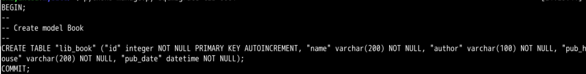

[TOC]

# Django基础  

## Django背景  

Django是Python开发的开源Web开发框架。使用Django能以最小的代价构建和维护高质量的Web应用。  

* 他适合开发内容类的网站（例如：博客，交流社区，图片分享站等）。**其设计目的是使常见的Web开发任务变得快速而简单**。

## Django概览  

* Django 也被称为 MTV 框架 。在 MTV 开发模式中:
  * **M 代表模型(Model),即数据存取层。 该层处理与数据相关的所有事务: 如何存取、如何验证有效性、包含哪些行为以及数据之间的关系等。**
  * **T 代表模板(Template),即表现层。 该层处理与表现相关的决定: 如何在页面或其他类型文档中进行显示。**
  * **V 代表视图(View),即业务逻辑层。 该层包含存取模型及调取恰当模板的相关逻辑。 你可以把它看作模型与模板之间的桥梁。**

### 设计模型Model  

* Django无需数据库就可以使用，通过**对象关系映射器**（Object-relational mapping），仅使用Python代码就可以描述数据结构。

  ``` python
  # myProject/myApp/models.py
  #创建一个名为book的模型，并定义了name和pub_date属性
  from django.db import models
  class book(models.Model):
  	name = models.CharField(max_length=100)
  	pub_date = models.DateField()
  ```

* `models.py` 文件主要用一个Python类来描述数据表。称为**模型（model）** 。运用这个类， 可以通过简单的Python代码来创建、检索、更新、删除数据库中的记录而无需写一条又一条的SQL语句。

### 设计视图Views  

* 在模型被定义后，我们便可以在视图中引用模型。通常，视图根据参数检索数据，加载一个模板，并使用检索到的数据呈现模板。

  ```python
  # myProject/myApp/views.py
  from django.shortcuts import render
  from .models import Person
  
  def book_archive(request, year):
  	book_list = Person.objects.filter(birth_year = year)
  	context = {'year': year, 'book_list': book_list}
  	return render(request, 'books/year_archive.html', context)
  ```

  * `views.py` 文件包含页面的业务逻辑。`book_archive()` 函数叫做**视图** 。这个函数将会返回`year_archive.html` 这一模板。

### 设计链接Urls  

* 优雅简洁的URL解析式是衡量高质量网站的重要标准。Django鼓励使用漂亮的URL设计。使用这些优美的URL， 只需要建立*URL和Python回调函数简单的映射关系（也就是建立URL与视图的映射关系，需要将相应的URL映射到对应的视图。）*。

  ```python
  # myProject/myApp/urls.py
  from django.urls import path
  from . import views
  
  urlpatterns = [ path('book/<int:year>', views.book_archive),]
  ```

* `urls.py` 指出了什么样的URL调用什么视图。在这里`books/xxxxx` 将会调用`year_archive()` 这个视图。也就是当进入这个链接时，会返回该视图函数的结果。  

### 设计模板Templates  

* Django拥有强大的模板功能，使用该模板能设计出强大的Web页面。

  ```python
  # /template/year_archive.html
  Books for {{ year }}
  
  {}
  <h1>Articles for {{year}}</h1>
  
  
  	<p>{{ book.name }}</p>
  	<p>Published {{ book.pub_date|date:"F j, Y" }}</p>
  
  
  	
  ```

* `year_archive.html` 是html模板， 使用**带基本逻辑声明的模板语言**， 如`` ， 他视图将函数返回的结果显示在网页上。

## 搭建环境  

### 创建项目  

* 安装：

  ```python
  sudo pip3 install Django==2.0.6
  ```

* 创建项目：

  ```python
  django-admin startproject mysite
  ```

  会在生成`mysite`以下的目录结构：  

  ```
  mysite/
      manage.py
      mysite/
          __init__.py
          settings.py
          urls.py
          wsgi.py
  ```

  这些目录和文件的作用分别是：

  - 外层的`mysite/`：是项目的容器，可以为任意名字。
  - `manage.py`：一种让你可以使用各种方式管理Django项目的命令行工具。在`mysite/`目录下输入`python3 manage.py help`，看一看它都能做什么。
  - 内层的`mysite/`：包含项目，是一个纯Python包。你可以在包里调用它内部的任何东西。
  - `__init__.py`：一个空文件，告诉Python这个目录应该被认为是一个Python包。一般，你不需要去修改它。
  - `settings.py`：Django项目的配置文件。
  - `urls.py`：Django项目的URL声明。
  - `wsgi.py`：作为项目的运行在WSGI兼容的Web服务器的入口。

* 启动django：

  ```python
  python3 manage.py runserver
  ```

## 视图  

Django中，每一个应用都是一个Python包，并且遵守着相同的约定。

Django自带一个工具，可以帮你生成应用的基本目录，极大地提高了开发效率。

进入`mysite`文件夹，在终端中输入：

```python
$ cd /home/shiyanlou/Code/mysite
$ python3 manage.py startapp lib
```

这将会创建一个名为`lib`的目录，以下是它的目录结构：

```python
lib/
    __init__.py
    admin.py
    apps.py
    migrations/
        __init__.py
    models.py
    tests.py
    views.py
```

打开 `lib/views.py`，输入以下代码：

```
# lib/views.py
from django.http import HttpResponse

def index(request)：
    return HttpResponse("Hello, world!")
```

在这里，想要看到的就是在页面中输出`Hello, world!`。

但仅编写视图函数，并不能在Django页面上显示出来。如果想要看到效果，我们需要使用URL来映射到它。

* 在`mysite/lib`目录里新建`urls.py`文件，并输入以下代码：

```
# lib/urls.py
from django.urls import path
from . import views

urlpatterns = [
    path('', views.index, name='index'),
]
```

这一步我们将应用`lib`里视图函数与URL映射到了一起。

我们来详细讲解一下`path()`函数,它共有4个参数：

| 参数   | 意义                                                         | 是否必须 |
| ------ | ------------------------------------------------------------ | -------- |
| route  | route 是一个匹配 URL 的准则（类似正则表达式）。当 Django 响应一个请求时，它会从 urlpatterns 的第一项开始，按顺序依次匹配列表中的项，直到找到匹配的项。 | 必须     |
| view   | 当 Django 找到了一个匹配的准则，就会调用这个特定的视图函数，并传入一个 HttpRequest 对象作为第一个参数，被“捕获”的参数以关键字参数的形式传入。 | 必须     |
| kwargs | 任意个关键字参数可以作为一个字典传递给目标视图函数。         | 可选     |
| name   | 为你的 URL 取名能使你在 Django 的任意地方唯一地引用它，尤其是在模板中。这个有用的特性允许你只改一个文件就能全局地修改某个 URL 模式。 | 可选     |

在上面的代码中，`route`为空意味着我们可以直接用链接`http://localhost:8000/lib/`访问该视图函数，`view=view.index`是调用了`view.py`中的`index`视图，`name`为`index`代表我们可以在模板中用index来引用返回的变量。

接下来，我们需要向`mysite/mysite/urls.py`告知使用应用`lib`的视图。

输入以下代码：

```
# mysite/mysite/urls.py
from django.contrib import admin
from django.urls import include, path

urlpatterns = [
    path('lib/', include('lib.urls')),
    path('admin/', admin.site.urls),
]
```

实现的原理就是使用了`include()`函数，它允许应用其他的URLconfs。

比如使用这个地址进行请求时：`http://localhost:8000/lib/`，首先在`mysite/mysite/urls.py`中会截断与此项匹配的 URL 部分，也就是`lib/`，然后将剩余的字符串发送到 URLconf 以供进一步处理。

## 模型  

### 配置数据库  

* Django的项目设置都包含在了`mysite/mysite/settings.py` 中。

* 在这里使用`SQLite` 作为默认的数据库文件。并将配置文件中的`TIME_ZONE` 为自己所在的时区：

  ```python
  TIME_ZONE = 'Asia/Shanghai'
  ```

### 创建模型  

**模型是真实数据的简明描述。**  

* 包含了存储的数据所必要的字段和行为。

* Django遵循**不要重复自己（DRY原则）**。他的目标是让你只需要定义数据模型，然后其他的东西都不用关心，都会从模型生成。

* 创建一个图书馆应用中，需要创建一个模型`Book`。该模型包含四个字段：书名、作者、出版社、出版日期。

* 向`mysite/lib/models.py` 写入如下代码：

  ```python
  #lib/models.py
  from django.db import models
  
  class Book(models.Model):
  	name = models.CharField(max_length=200)
  	author = models.CharField(max_length=100)
  	pub_house = models.CharField(max_length=200)
  	pub_date = models.DateTimeField('date published')
  ```

  从代码可以看出，模型是`django.db.models.Model` 类的子类。

* 每个模型都有一些类变量，表示模型里的一个数据库字段。

* 每个字段都是`Field` 类的实例。例如字符字段：`CharField`，日期字段：`DateTimeField` 。也就是每个字段需要处理的数据类型。

* 定义某些`Field` 类实例需要参数。**这个参数不止于用了定义数据结构，也用于验证数据。

### 激活模型  

通过之前的代码，Django可以：

* 为这个应用创建数据库schema（生成`CREATE TABLE` 语句）。
* 创建可以与`Book` 对象进行交互的Python数据库API。

首先，需要我们将lib应用安装到我们的项目中：  

* `LibConfig` 类写在文件lib/apps.py中。所以他的路径为`lib.apps.LibConfig`。在设置文件中添加路径：

  ```python
  # mysite/mysite/settings.py
  INSTALLED_APPS = [
      'lib.apps.LibConfig',
      'django.contrib.admin',
      ...
  ]
  ```

  现在Django项目就会包含lib应用。运行下面的命令：

  ```python
  $ python3 manage.py makemigrations lib
  ```

  **通过运行`makemigrations` 命令，Django会检测对模型的修改，并把修改的部分存储为一次*迁移***。

  可以通过下面的命令查看迁移命令会执行哪些SQL语句：

  ```python
  python3 manage.py sqlmigrate lib 0001
  ```

  

现在运行`migrate` 命令，在数据库中创建新定义的模型的数据表：

```python
python3 manage.py migrate 
```

> 创建好模型后需要，使用该命令来将对模型的修改应用于数据库。

### 使用API  

可以使用Django来创建各种API：

```python
python3 manage.py shell
```

使用这个命令而不是简单的使用 "Python" 是因为 manage.py 会设置 `DJANGO_SETTINGS_MODULE` 环境变量，这个变量会让 Django 根据 `mysite/settings.py` 文件来设置 Python 包的导入路径。

```python
>>>from lib.models import Book
>>>Book.objects.all()   #获取Book所有对象
<QuerySet []>
>>>from django.utils import timezone
>>>b = Book(name='Business', author='Tom', pub_house='First Press', pub_date=timezone.now())    #创建
>>>b.save() #保存
>>>b.id
1
>>>b.name
'Business'
>>>b.pub_date
datetime.datetime(2018, 7, 4, 2, 29, 7, 578323, tzinfo=<UTC>)
```

改变模型需要这三步：

- 编辑 `models.py` 文件，改变模型。
- 运行 `python manage.py makemigrations` 为模型的改变生成迁移文件。
- 运行 `python manage.py migrate` 来应用数据库迁移。

## 模板  

### 创建模板  

首先，在你的 `mysite/lib` 目录里创建一个 `templates` 目录。Django 将会在这个目录里查找模板文件。

在 `mysite/mysite/settings.py` 文件中的 `TEMPLATES` 配置项描述了 Django 如何载入和渲染模板。默认的设置文件设置了 `DjangoTemplates` 后端，并设置 `APP_DIRS = True`。这一选项将会让 `DjangoTemplates` 在每个 `INSTALLED_APPS` 文件夹中寻找 `templates` 子目录。

新建模板文件 `lib/templates/lib/detail.html` ，并向其中写入如下代码：

```python
# lib/templates/lib/detail.html
<h1>Book List</h1>
<table>
    <tr>
        <td>书名</td>
        <td>作者</td>
        <td>出版社</td>
        <td>出版时间</td>
    </tr>

    <tr>
        <td>{{ book.name }}</td>
        <td>{{ book.author }}</td>
        <td>{{ book.pub_house }}</td>
        <td>{{ book.pub_date }}</td>
    </tr>

</table>
```

模板统一使用点符号`.`来访问变量的属性。在示例 `{{ book.name }}` 中，首先 Django 尝试对 book 对象使用字典查找（也就是使用 `obj.get(str)` 操作），如果失败了就尝试属性查找（也就是 `obj.str` 操作），结果是成功了。如果这一操作也失败的话，将会尝试列表查找（也就是 `obj[int]` 操作）。

在 `` 循环中发生的函数调用：`book_list.all`被解释为 Python 代码 `book_list.objects.all()` ，将会返回一个可迭代的 `Book` 对象，这一对象可以在 `` 标签内部使用。

### 创建视图  

创建视图来返回图书列表：

```python
# mysite/lib/views.py
from django.shortcuts import render
from .models import Book

def detail(request):
    book_list = Book.objects.order_by('-pub_date')[:5]
    context = {'book_list': book_list}
    return render(request, 'lib/detail.html', context)
```

在此视图函数`detail`中，首先将数据库的Book列表按照`pub_date`时间来排序，存储到变量`book_list`中。

「载入模板，填充上下文，再返回由它生成的 HttpResponse 对象」是一个非常常用的操作流程。于是 Django 提供了一个快捷函数`render()`。

`render()`函数把`request`对象作为它的第一个参数，模板作为第二个参数，字典作为它的可选的第三个参数。它返回给定模板呈现的给定文本的一个`HttpResponse`对象。

在这里，`context`信息将会返回到模板`lib/detail.html`。

### 绑定链接  

将新视图添加进**lib.urls**模块里：

```python
# lib/urls.py
from django.urls import path

from . import views

urlpatterns = [
    path('', views.index, name='index'),
    path('detail/', views.detail, name='detail'),
]
```