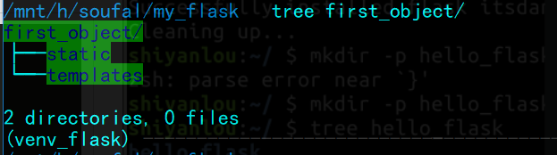

[TOC]

# Flask  

## 基本概念  

### 什么是`Flask`?  

`Flask` 是一个`web` 框架。他可以为我们提供工具、库和技术来允许我们构建一个`web` 应用程序。这个 web 应用程序可以是一些 web 页面、博客、wiki、基于 web 的日历应用或商业网站。  

`Flask` 属于微框架（mirco-gramework）这一类别，微架构通常是很小的不依赖外部库的框架。

* 优点是框架很轻量，更新时依赖少，并且专注安全方面的`bug` 。
* 缺点是：不得不自己做更多的工作，或通过添加插件增加自己的依赖列表。

`Flask` 的依赖如下：  

* `Werkzeug` 一个WSGI工具包。
* `jinjia2` 模板引擎。  

> **Web服务器网关接口（Python Web Server Gateway Interface，缩写为WSGI）**是为Python语言定义的Web服务器和Web应用程序或框架之间的一种简单而通用的接口。自从WSGI被开发出来以后，许多其它语言中也出现了类似接口。
>
> 也就是一个连接Web服务器和Web应用或框架的接口。  

### 什么是模板引擎？  

使用模板使得我们可以设置自己的页面基本布局，并提及哪个元素将发生变化。

这种方式可以定义我们的网页头部并在我们的网站的所有页面使它保持一致。如果需要改变网页头部，只需要更新一个地方即可更新所有的网页。  

## 简单应用  

* 安装：  

  ```python
  sudo pip3 install flask
  ```

* 创建项目结构：  

  ```python
  mkdir -p my_flask/{templates,static}
  ```

  这样我们的web应用的基本结构为：  

  

  其中：

  * `templates` 文件夹是存放模板的地方。
  * `static` 文件夹是存放web应用所需的静态文件的地方（`images，CSS，javascript`）。

* 创建应用文件：

  ```python
  cd my_flask
  vim hello_flask.py
  ```

  hello_flask.py 文件里编写如下代码：

  ```python
  #!/usr/bin/env python3
  
  import flask
  
  
  # Create the application.
  APP = flask.Flask(__name__)
  
  
  @APP.route('/')
  def index():
      """ 显示可在 '/' 访问的 index 页面
      """
      return flask.render_template('index.html')
  
  
  if __name__ == '__main__':
      APP.debug=True
      APP.run()
  ```

- 创建模板文件 `index.html`

```python
$ vim templates/index.html
```

index.html 文件内容如下：

```python
<!DOCTYPE html>
<html lang='en'>
<head>
  <meta charset="utf-8" />
  <title>Hello world!</title>
  <link type="text/css" rel="stylesheet"
        href="{{ url_for('static',
              filename='hello.css')}}" />
</head>
<body>

It works!

</body>
</html>
```

- 运行 flask 应用程序

```python
$ python3 hello_flask.py
```

访问 <http://127.0.0.1:5000/>，

### 使用参数  

如何根据用户使用的 URL 返回网页。

为此我们更新 hello_flask.py 文件。

- 在 hello_flask.py 文件中添加以下条目

```python
@APP.route('/hello/<name>/')
def hello(name):
    """ Displays the page greats who ever comes to visit it.
    """
    return flask.render_template('hello.html', name=name)
```

- 创建下面这个模板 hello.html

```python
<!DOCTYPE html>
<html lang='en'>
<head>
    <meta charset="utf-8" />
    <title>Hello</title>
    <link type="text/css" rel="stylesheet"
          href="{{ url_for('static',
               filename='hello.css')}}" />
</head>
<body>

      Hello {{name}}

</body>
</html>
```

- 运行 flask 应用

```python
$ python3 hello_flask.py
```

访问 <http://127.0.0.1:5000/> ，这应该只是显示黑字白底的 "It works!" 文本。

访问<http://127.0.0.1:5000/hello/you>，这应该返回文本 "Hello you"，见下图：


无论你在 URL 中 `/hello/` 后填写的什么，都会出现在返回的网页中。

这是你第一次使用模板，我们在 hello_flask.py 中建立了 `name` 变量（参见 hello 函数的 return 行）。通过语法 `{{name}}`，name 变量之后在页面中显示其自身。  

### 额外工作  

对于每一个页面我们都创建了一个模板，其实这是不好的做法，我们应该做的是创建一个主模板并且在每个页面使用它。

- 创建模板文件 master.html。

```python
<!DOCTYPE html>
<html lang='en'>
<head>
  <meta charset="utf-8" />
  <title> - Hello Flask!</title>
  <link type="text/css" rel="stylesheet"
       href="{{ url_for('static',
                        filename='hello.css')}}" />
</head>
<body>



</body>
</html>
```

- 调整模板 index.html。

```python


Home


It works!

```

正如你所看到的，在 master.html 模板中我们定义了两部分，名为 `title` 和 `body` 的 `blocks`。

在模板 index.html 中，我们声明这个模板扩展自 master.html 模板，然后我们定义了内容来放在这两个部分中（blocks）。在第一个 block `title` 中，我们放置了 `Home` 单词，在第二个 block `body` 中我们定义了我们想要在页面的 body 中有的东西。

- 作为练习，更改其他模板 hello.html，同样要使用 master.html。
- 在 hello 页面添加首页链接。

调整模板 hello.html，添加到首页的链接。

```python
<a href="{{ url_for('index') }}"><button>Home</button></a>
```

- 作为你的任务，在首页添加到 hello 页面的链接。