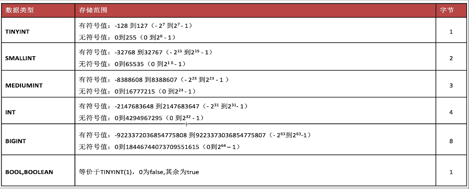
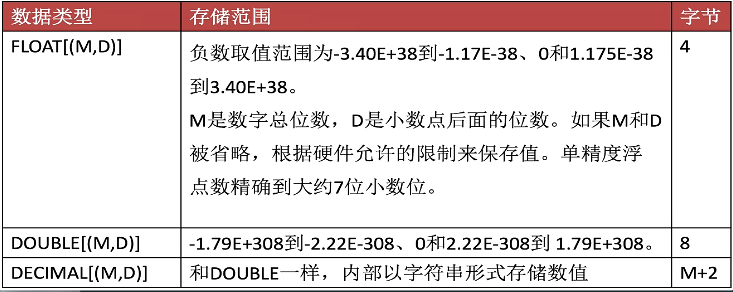
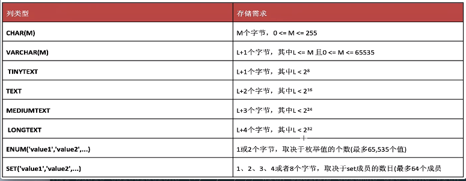
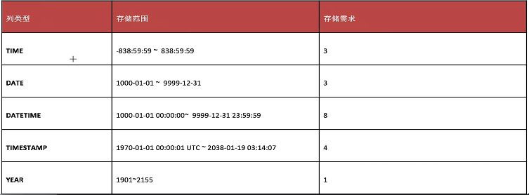

### 什么是数据库？

* mysql登录：`mysql -uroot -p`
  * 带服务器端口的登录：`mysql -hlocalhost -uroot -p-P3006` 
* 配置文件为：`my.cnf` 。









* 创建一个表：

  ```SQL
  #用户表 user
  CREATE TABLE IF NOT EXISTS user( 
      id INT, 
      usrname VARCHAR(20), 
      password CHAR(32), 
      email VARCHAR(50), 
      age TINYINT, 
      card CHAR(18), 
      tel CHAR(11), 
      salary FLOAT(8,2), 
      married TINYINT(1), 
      sex ENUM('男','女','保密')
  )ENGINE=INNODB CHARSET = UTF8;
  ```

* 表中插入一条记录：

  ```SQL
  --INSERT [INFO] tbl_name(id, username,...) VALUES(1,'soufal'...);
  INSERT user(id, usrname, password, email, age, card, tel, salary, married,sex) VALUES(1, 'soufal', 'soufal', '12312@qq.com', 25, '124343542421', '15310620699', 888888, 0, '女');
  ```

* 查询表中记录：

  ```SQL
  --SELECT * FROM tabl-name;
  SELECT * FROM user;
  ```

* 测试整型

  ```sql
  CREATE TABLE test_int(
      a tinyint,
      b smallint,
      c mediumint,
      d int,
      e bigint
  	);
  INSERT test_int(a) VALUES(-128);
  -- 如果超出数据的范围，会产生截断的现象。
  INSERT test_int(a) VALUES(-129);
  ```

* 测试无符号：

  ```sql
  CREATE TABLE test_unsigned(
      a tinyint,
      b tinyint unsigned
  );
  INSERT test_unsigned(a, b) VALUES(-12, -12);
  INSERT test_unsigned(a, b) VALUES(0, 0);
  
  ```

* 测试浮点型：

  ```sql
  CREATE TABLE test_float(
  a FLOAT(6,2),
  b DOUBLE(6,2),
  c DOUBLE(6,2)
  );
  
  INSERT test_float(a,b,c) VALUES(4.142,4.146,4.149);
  ```

* 用户表：

  ```SQL
  CREATE TABLE IF NOT EXISTS `my_user`(
  `id` INT UNSIGNED AUTO_INCREMENT KEY COMMENT '用户编号',
  `username` VARCHAR(20) NOT NULL UNIQUE COMMENT '用户名',
  `password` CHAR(32) NOT NULL COMMENT '密码',
  `email` VARCHAR(50) NOT NULL COMMENT '邮箱',
  `age` TINYINT UNSIGNED NOT NULL DEFAULT 18 COMMENT '年龄'，
  `sex` ENUM(`男`，`女`，`保密`) NOT NULL DEFAULT `保密` COMMENT '性别'，
  `addr` VARCHAR(50) NOT NULL DEFAULT `北京` COMMENT '地址'，
  `card` CHAR(18) NOT NULL UNIQUE COMMENT '身份证号'，
  `married` TINYINT(1) NOT NULL DEFAULE 0 COMMENT '0代表为结婚，1代表已结婚')ENGINE=INNODB DEFAULT CHARSET=UTF8;
  ```
