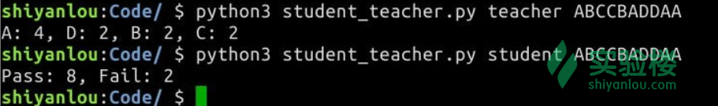
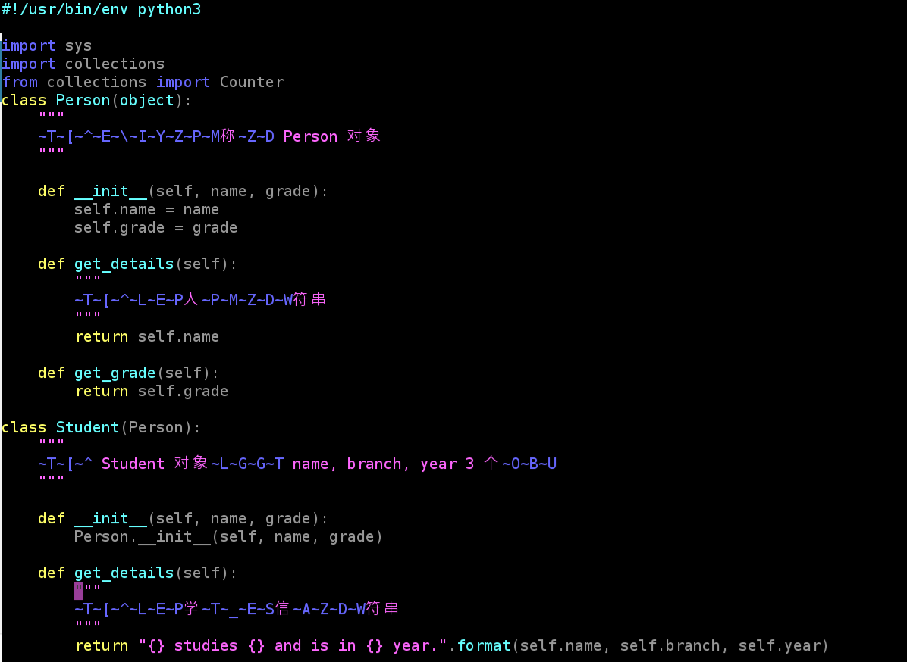
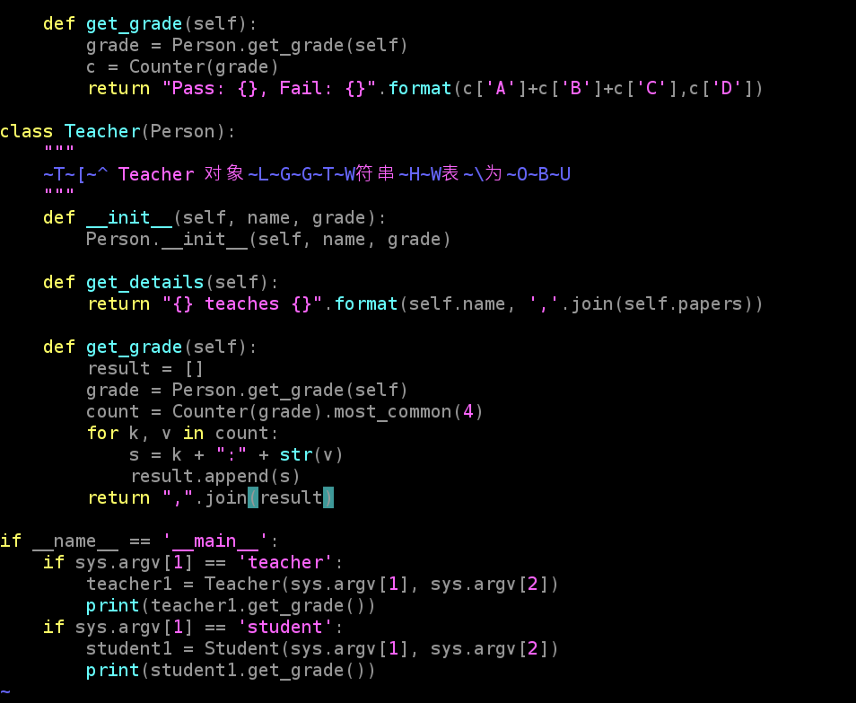
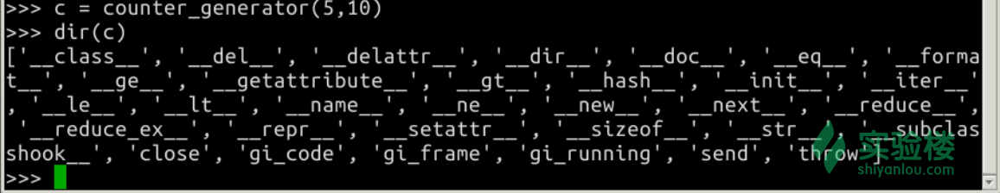
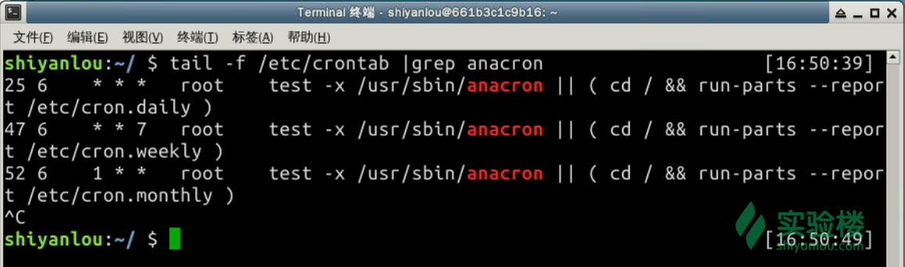
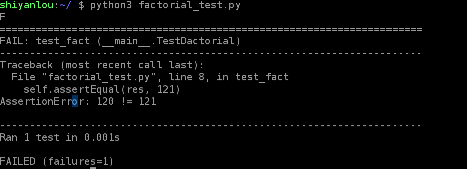
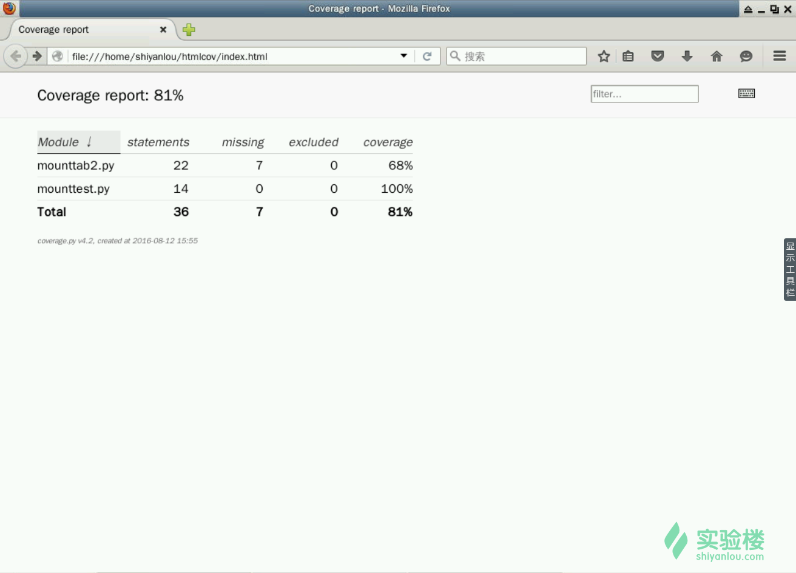
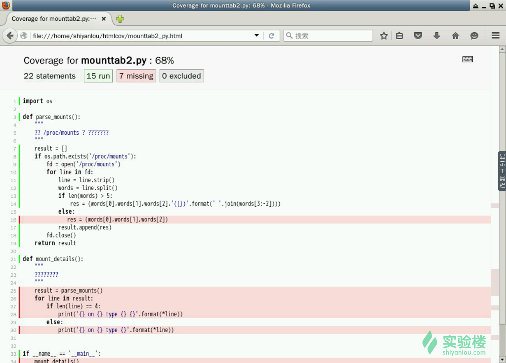
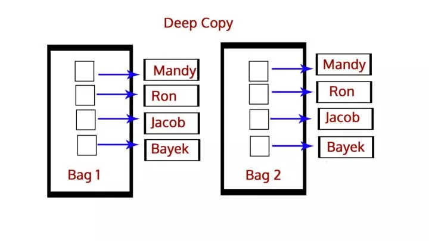

## 

## python3    

[TOC]


## 类型转换：  

我们可以手动的执行类型转换。

| 类型转换函数    | 转换路径         |
| --------------- | ---------------- |
| `float(string)` | 字符串 -> 浮点值 |
| `int(string)`   | 字符串 -> 整数值 |
| `str(integer)`  | 整数值 -> 字符串 |
| `str(float)`    | 浮点值 -> 字符串 |

## **列表**：  

* `append()` 添加元素到列表末尾。

* `insert()`在任意位置插入元素。

* `count(s)`返回列表元素中s的数量。

* `remove()`移除列表中的任意指定值。

* `reverse()`反转整个列表。

* `extend(b)`将列表b中的所有元素添加到另一个列表的末尾。

* `sort()`用于给列表排序，前提是列表的元素是可比较的。

* `del()`删除指定位置的列表元素。

* 将列表用作**栈**：  

  * `pop()`弹出末尾的元素。可以使用`pop(i)`弹出第i个元素。

* 将列表用作**队列**：

  * 使用`pop(0)`弹出列表中的第一个元素。  

* 创建列表---**列表推导式**：列表推导式为从序列中创建列表提供了一个简单的方法。如果没有列表推导式，一般都是这样创建列表的：通过将一些操作应用于序列的每个成员并通过返回的元素创建列表，或者通过满足特定条件的元素创建子序列。 可以如下创建：  

  ```python
  >>> squares = []
  >>> for x in range(10):
  ...     squares.append(x**2)
  ...
  >>> squares
  [0, 1, 4, 9, 16, 25, 36, 49, 64, 81]
  ```

  注意这个 for 循环中的被创建（或被重写）的名为 `x` 的变量在循环完毕后依然存在。使用如下方法，我们可以计算 squares 的值而不会产生任何的副作用：

  ```python
  squares = list(map(lambda x: x**2, range(10)))
  ```

  等价于：  

  ```python
  squares = [x**2 for x in range(10)]
  ```

  列表推导式由包含一个表达式的中括号组成，表达式后面跟随一个 for 子句，之后可以有零或多个 for 或 if 子句。结果是一个列表，由表达式依据其后面的 for 和 if 子句上下文计算而来的结果构成。

  例如，如下的列表推导式结合两个列表的元素，如果元素之间不相等的话：

  ```python
  >>> [(x, y) for x in [1,2,3] for y in [3,1,4] if x != y]
  [(1, 3), (1, 4), (2, 3), (2, 1), (2, 4), (3, 1), (3, 4)]
  ```

  等同于： 

  ```python
  >>> combs = []
  >>> for x in [1,2,3]:
  ...     for y in [3,1,4]:
  ...         if x != y:
  ...             combs.append((x, y))
  ...
  >>> combs
  [(1, 3), (1, 4), (2, 3), (2, 1), (2, 4), (3, 1), (3, 4)]
  ```

  列表推导式也可以嵌套:  

  ```python
  >>> a=[1,2,3]
  >>> z = [x + 1 for x in [x ** 2 for x in a]]
  >>> z
  [2, 5, 10]
  ```

- 如果你想要检查列表是否为空，请这样做：

  ```python
  if list_name: # 列表不为空
      pass
  else: # 列表为空
      pass
  ```

- 

## **字符串**：  

* `split()`函数[split(str="", num=string.count(str))](http://www.runoob.com/python3/python3-string-split.html)  以str为分隔符截取字符串，如果num有指定值，则仅截取num个字符串。str -- 分隔符，默认为所有的空字符，包括空格、换行(\n)、制表符(\t)等。num -- 分割次数。分割后的字符串转换为了list。如下：  

  ```python
  >>> s = "We all love Python"
  >>> s.split()
  ['We', 'all', 'love', 'Python']
  >>> x = "shiyanlou:is:waiting"
  >>> x.split(':')
  ['shiyanlou', 'is', 'waiting']
  ```

* `join()`方法使用指定字符连接多个字符串，需要一个包含字符串元素的列表作为输入，然后连接列表内的字符串元素。  如下：  

  ```python
  >>> "-".join("GNU/Linux is great".split())
  'GNU/Linux-is-great'
  ```

  在上面的例子中，我们基于空格 `" "` 分割字符串 `"GNU/Linux is great"`，然后用 `"-"` 连接它们。 

* 字符串实现反转的方法：  

  * 使用字符串切片：`result = s[::-1]`
  * 使用列表的reverse（）：`l = list(s) result = “".join(l.reverse())"”`

* 分几行输入字符串，并且希望行尾的换行符自动包含到字符串当中，可以使用三对引号：`"""..."""` 或 `'''...'''` 。 例如：  

  ```python
  >>> print("""\
  ... Usage: thingy [OPTIONS]
  ...      -h                        Display this usage message
  ...      -H hostname               Hostname to connect to
  ... """)
  Usage: thingy [OPTIONS]
       -h                        Display this usage message
       -H hostname               Hostname to connect to
  ```

* 返回字符串的标题版本：`title()` ，即单词首字母大写，其余字母小写。  

* 使用`upper()`返回字符串的全部大写的版本。使用`lower()`返回字符串的全部小写版本。

* `swapcase()`返回字符串大小写交换后的版本。

* `isalnum()`检查所有的字符是否为字母或数字，若全为字母或数字则返回`True`，否则返回`False`。  

* `isalpha()`检查字符串之中是否只有字母。

* `isdigit()`检查字符串之中是否只有数字。

* `islower()`检查字符串之中是否所有字母为小写。

* `istitle()`检查字符串是否为标题样式。

* `isupper()`检查字符串中所以字符是否为大写。  


* “`Year {} Rs. {:.2f}".format(year, value)` 称为字符串格式化，大括号和其中的字符会被替换成传入 `str.format()` 的参数，也即 `year` 和 `value`。其中 `{:.2f}` 的意思是替换为 2 位精度的浮点数。 

* `divmod(num1, nim2)`返回一个元祖，包含两个值，第一个是num1和num2**相整除**得到的值，第二个是num1和num2**求余**得到的值。

* count()方法语法：

  ```python
  str.count(sub, start= 0,end=len(string))
  ```

  - sub -- 搜索的子字符串
  - start -- 字符串开始搜索的位置。默认为第一个字符,第一个字符索引值为0。
  - end -- 字符串中结束搜索的位置。字符中第一个字符的索引为 0。默认为字符串的最后一个位置。  
  - 返回子字符串在字符串中出现的次数。  

------------------------------------------------------------

## 字典：    

* `get()` ：Python 字典 get() 函数返回指定键的值，如果值不在字典中返回默认值。

  * get()方法语法：

    ```python
    dict.get(key, default=None)
    ```

  - 参数：
    - `key` -- 字典中要查找的键。
    - `default` -- 如果指定键的值不存在时，返回该默认值值。
  - 例子：`available.get(k, 0)` ：若k不存在，则返回`0`。

  ## 

## 

## 函数：

* lambda: 用于创建匿名函数。，通常是在需要一个函数，但是又不想费神去命名一个函数的场合下使用，也就是指匿名函数。   

  * lambda的一般形式是关键字lambda后面跟一个或多个参数，然后紧跟一个冒号，最后是一个表达式。**lambda是一个表达式，而不是一个语句**。他可以返回一个值（即一个新的函数）。在只需要编写简单函数的情况下，可以使用它来代替def：  

    ```python
    f = lambda x,y,z : x+y+z  
    print f(1,2,3)  
      
    g = lambda x,y=2,z=3 : x+y+z  
    print g(1,z=4,y=5) 
     
    结果：
    6  
    10  
    ```

  * lambda表达式常用来编写跳转表（jump table），也就是行为的列表或字典（相当于C中的switch...case）：  

    ```python
    L = [(lambda x: x**2),  
        (lambda x: x**3),  
        (lambda x: x**4)]  
    print L[0](2),L[1](2),L[2](2)  
    # 这里的方括号内容对应于L中的每一种情况，圆括号的内容对应于参数的值。
    D = {'f1':(lambda: 2+3),  
        'f2':(lambda: 2*3),  
        'f3':(lambda: 2**3)}  
    print D['f1'](),D['f2'](),D['f3']() 
     
    结果：
    4 8 16  
    5 6 8 
    ```

  * **闭包**---一个定义在函数内的函数，他使得变量即使脱离了该函数的作用于范围也依然能够被访问到。  

    ```python
    >>> def my_add(n):
    ...     return lambda x:x+n
    
    >>> add_3 = my_add(3)
    >>> add_3(7)
    10
    ```

    这里lambda函数就是一个闭包，在全局作用域范围中，add_3(7)可以正常执行且返回值为10，之所以返回10是因为在my_add局部作用域中，变量n的值在闭包的作用使得它在全局作用域也可以被访问到。 

* **map()** 会根据提供的函数对指定序列做映射。

  第一个参数 function 以参数序列中的每一个元素调用 function 函数，返回包含每次 function 函数返回值的新列表。

  map() 函数语法：

  ```python
  map(function, iterable, ...)
  ```

* `sorted()`函数：  

  **sorted()** 函数对所有可迭代的对象进行排序操作。

> **sort 与 sorted 区别：**
>
> sort 是应用在 list 上的方法，sorted 可以对所有可迭代的对象进行排序操作。
>
> list 的 sort 方法返回的是对已经存在的列表进行操作，而内建函数 sorted 方法返回的是一个新的 list，而不是在原来的基础上进行的操作。  

sorted 语法：

```python
sorted(iterable, key=None, reverse=False)  
```

参数说明：

- iterable -- 可迭代对象。
- key -- 主要是用来进行比较的元素，只有一个参数，具体的函数的参数就是取自于可迭代对象中，指定可迭代对象中的一个元素来进行排序。
- reverse -- 排序规则，reverse = True 降序 ， reverse = False 升序（默认）。  

`>>>sorted([5, 2, 3, 1, 4]) [1, 2, 3, 4, 5]                      # 默认为升序`

你也可以使用 list 的 list.sort() 方法。这个方法会修改原始的 list（返回值为None）。通常这个方法不如sorted()方便-如果你不需要原始的 list，list.sort()方法效率会稍微高一些。

`>>>a=[5,2,3,1,4] >>> a.sort() >>> a [1,2,3,4,5]`

另一个区别在于list.sort() 方法只为 list 定义。而 sorted() 函数可以接收任何的 iterable。

`>>>sorted({1: 'D', 2: 'B', 3: 'B', 4: 'E', 5: 'A'}) [1, 2, 3, 4, 5]`

利用key进行倒序排序

要进行反向排序，也通过传入第三个参数 reverse=True：

`>>>example_list = [5, 0, 6, 1, 2, 7, 3, 4] >>> sorted(example_list, reverse=True) [7, 6, 5, 4, 3, 2, 1, 0]`  

* `ord()` 函数：  

  ord() 函数是 chr() 函数（对于8位的ASCII字符串）或 unichr() 函数（对于Unicode对象）的配对函数，它以一个字符（长度为1的字符串）作为参数，返回对应的 ASCII 数值，或者 Unicode 数值，如果所给的 Unicode 字符超出了你的 Python 定义范围，则会引发一个 TypeError 的异常。 

- 在 Python 里我们使用文档字符串（*docstrings*）来说明如何使用代码，这在交互模式非常有用，也能用于自动创建文档。下面我们来看看使用文档字符串的例子。

  ```python
  #!/usr/bin/env python3
  import math
  def longest_side(a, b):
      """
      Function to find the length of the longest side of a right triangle.
      :arg a: Side a of the triangle
      :arg b: Side b of the triangle
      :return: Length of the longest side c as float
      """
      return math.sqrt(a*a + b*b) 
  if __name__ == '__main__':
      print(longest_side.__doc__)
      print(longest_side(4,5))
  ```

- 高阶函数（*Higher-order function*）或仿函数（*functor*）是内部至少含有一个以上步骤的函数：

  - 使用一个或多个函数作为参数
  - 返回另一个函数作为输出

  Python 里的任何函数都可以作为高阶函数。

  ```python
  >>> def high(func, value):
  ...     return func(value)
  ...
  >>> lst = high(dir, int)
  >>> print(lst[-3:])
  ['imag', 'numerator', 'real']
  ```

- #### map 函数

  `map` 是一个在 Python 里非常有用的高阶函数。它接受一个函数和一个序列（迭代器）作为输入，然后对序列（迭代器）的每一个值应用这个函数，返回一个序列（迭代器），其包含应用函数后的结果。

  举例：

  ```pythons
  >>> lst = [1, 2, 3, 4, 5]
  >>> def square(num):
  ...     "返回所给数字的平方."
  ...     return num * num
  ...
  >>> print(list(map(square, lst)))
  [1, 4, 9, 16, 25]
  ```

## 文件：  

- #### open()函数

  打开文件，需要两个参数：    

  - 一是文件路径或文件名；
  - 二是文件中的打开模式。  
    - `r` ：以只读模式打开，只能读取文件但不能编辑/删除文件的任何内容。
    - `w`：以写入模式打开，如果文件存在将会删除里面的所有内容，然后打开这个文件进行写入。
    - `a`：以追加模式打开，写入文件中的任何数据将自动添加到末尾。    

  > 不要轻易对有内容的文件以写入的方法打开,这样会删掉文件的所有内容.

  默认模式为只读模式。使用`close()`方法来关闭文件。  

- #### read()函数

  使用`read()`方法来一次性读取整个文件。在调用一次`read()`后，再次使用只会返回一个空字符串，因为他已经读取完了整个文件。

  `read(size)`有一个可选的参数`size`，用于指定字符串长度。如果没有指定或者指定为负数，就会读取并返回整个文件。当文件大小为当前机器内存两倍时，就会产生问题。反之，会尽可能按比较大的`size`读取和返回数据。  

  - `readline()`能帮助每次读取文件的一行。

  - `readlines()`读取所有行到一个列表中。  

    可以使用一个程序接受用户输入的字符串作为将要读取的文件的文件名，并且在屏幕上打印文件内容。

    ```python
    #!/usr/bin/env python3
    name = input("Enter the file name: ")
    fobj = open(name)
    print(fobj.read())
    fobj.close()
    ```

- #### write()函数：

  可以使用`write()`函数打开一个文件然后写入一些文本。  

- #### sys模块：

  `sys.argv`包含了所有命令行参数。它的第一个值是命令本身的名字[0]。

- #### enumerate（iterableobject）函数：

  在序列中循环时，可以使用它同时得到索引位置和对应值。  

  *对任意给定文本文件中的制表符、行、空格进行计数。代码写入文件 `/home/shiyanlou/parsefile.py`：*

  ```python
  #!/usr/bin/env python3 
  import os
  import sys
  ```

  def parse_file(path):
      """
      分析给定文本文件，返回其空格、制表符、行的相关信息

```python
  :arg path: 要分析的文本文件的路径

  :return: 包含空格数、制表符数、行数的元组
  """
  fd = open(path)
  i = 0
  spaces = 0
  tabs = 0
  for i,line in enumerate(fd):
      spaces += line.count(' ')
      tabs += line.count('\t')
  # 现在关闭打开的文件
  fd.close()

  # 以元组形式返回结果
  return spaces, tabs, i + 1
```


```python
    def main(path):

      """

      函数用于打印文件分析结果

  :arg path: 要分析的文本文件的路径
  :return: 若文件存在则为 True，否则 False
  """
  if os.path.exists(path):
      spaces, tabs, lines = parse_file(path)
      print("Spaces {}. tabs {}. lines {}".format(spaces, tabs, lines))
      return True
  else:
      return False
      
    if name == 'main':

      if len(sys.argv) > 1:

          main(sys.argv[1])

      else:

          sys.exit(-1)

      sys.exit(0)

```


```python
* #### with语句：  

  尝试使用 `with` 语句处理文件对象，它会在文件用完后会自动关闭，就算发生异常也没关系。它是 try-finally 块的简写：

  ```python
  >>> with open('sample.txt') as fobj:
  ...     for line in fobj:
  ...         print(line, end = '')
  ... 
  I love Python
  I love shiyanlou
```

## 异常处理：  

- 我们使用 `try...except` 块来处理任意异常。基本的语法像这样：

  ```python
  try:
      statements to be inside try clause
      statement2
      statement3
      ...
  except ExceptionName:
      statements to evaluated in case of ExceptionName happens
  ```

  它以如下方式工作：

  - 首先，执行 `try` 子句 （在 [`try`](https://docs.python.org/3/reference/compound_stmts.html#try) 和 [`except`](https://docs.python.org/3/reference/compound_stmts.html#except) 关键字之间的部分）。

  - 如果没有异常发生，`except` 子句 在 [`try`](https://docs.python.org/3/reference/compound_stmts.html#try) 语句执行完毕后就被忽略了。

  - 如果在 `try` 子句执行过程中发生了异常，那么该子句其余的部分就会被忽略。

    如果异常匹配于 [`except`](https://docs.python.org/3/reference/compound_stmts.html#except) 关键字后面指定的异常类型，就执行对应的 `except` 子句。然后继续执行 [`try`](https://docs.python.org/3/reference/compound_stmts.html#try) 语句之后的代码。

  - 如果发生了一个异常，在 [`except`](https://docs.python.org/3/reference/compound_stmts.html#except) 子句中没有与之匹配的分支，它就会传递到上一级 [`try`](https://docs.python.org/3/reference/compound_stmts.html#try) 语句中。

    如果最终仍找不到对应的处理语句，它就成为一个 *未处理异常*，终止程序运行，显示提示信息。

- 使用 `raise` 语句抛出一个异常。

  ```python
  >>> raise ValueError("A value error happened.")
  Traceback (most recent call last):
    File "<stdin>", line 1, in <module>
  ValueError: A value error happened.
  ```

  我们可以捕获任何其它普通异常一样，来捕获这些异常。

  ```python
  >>> try:
  ...     raise ValueError("A value error happened.")
  ... except ValueError:
  ...     print("ValueError in our code.")
  ...
  ValueError in our code.
  ```

- `try` 语句还有另一个可选的 `finally` 子句，目的在于定义在任何情况下都一定要执行的功能。例如:

  ```python
  >>> try:
  ...     raise KeyboardInterrupt
  ... finally:
  ...     print('Goodbye, world!')
  ...
  Goodbye, world!
  KeyboardInterrupt
  Traceback (most recent call last):
    File "<stdin>", line 2, in ?
  ```

  不管有没有发生异常，`finally` 子句 在程序离开 `try` 后都一定会被执行。当 `try` 语句中发生了未被 `except` 捕获的异常（或者它发生在 `except` 或 `else` 子句中），在 `finally`子句执行完后它会被重新抛出。

  在真实场景的应用程序中，`finally` 子句用于释放外部资源（文件或网络连接之类的），无论它们的使用过程中是否出错。

## 类：  

面向过程的程序设计把计算机程序视为一系列的命令集合，即一组函数的顺序执行。为了简化程序设计，面向过程把函数继续切分为子函数，即把大块函数通过切割成小块函数来降低系统的复杂度。

面向对象的程序设计把计算机程序视为一组对象的集合，而每个对象可以接受来自其他对象发过来的消息，并处理这些消息。计算机程序的执行就是一系列消息在各个对象之间传递。

python使用类（class）和对象（object）进行**面向对象**（object-oriented programming，简称OOP）的编程。其主要目的是提高程序的**重复使用性**。根据对象的属性相近把他们分为相同的类。

> 类和对象提高了程序的可复用性，加强了程序模拟真实世界的能力。“模拟”----面向对象编程的核心。

- 在写你的第一个类之前，你应该知道它的语法。我们以下面这种方式定义类：

  ```python
  class nameoftheclass(parent_class):
      statement1
      statement2
      statement3
  ```

- 在类的声明中你可以写任何 Python 语句，包括定义函数（在类中我们称为方法）。

  ```python
  >>> class MyClass(object):
  ...     """A simple example class"""
  ...     i = 12345
  ...     def f(self):
  ...         return 'hello world'
  ```

  ```python
  class Bird(object):
      feather = True
      reproduction  = "egg"
      def chirp(self, sound):
          print(sound)
  summer = Bird() 
  print(summer.reproduction)      # 打印'egg'
  summer.chirp("jijiji")          # 打印'jijiji'
  ```

  * 在这里，我们用关键字class来定义一个类。类的名字就是鸟（Bird）。括号里有一个关键词object，也就是“东西”的意思，即某一个个体。在计算机语言中，我们把个体称为对象。一个类别下，可以有多个个体。

  * 在隶属于这个类别的程序块中，我们定义了两个量，一个用于说明鸟类有羽毛（feather），另一个用于说明鸟类的繁殖方式（reproduction），这两个量称为类的**属性（attribute）**。

  * 这些动作会带来一定的结果，比如移动导致位置的变化。这样的一些“行为”属性称为**方法**（method）。Python中，一般通过在类的内部定义函数来说明方法。方法chirp()看起来很像一个函数。它的第一个参数是self，是为了在方法内部引用对象自身。无论该参数是否用到，方法的第一个参数必须是用于指代对象自身的self。剩下的参数sound是为了满足我们的需求设计的。

  * 说明summer是属于鸟类的一个对象。现在，我们就可以使用鸟类中已经写好的代码了。作为对象的summer将拥有鸟类的属性和方法。对属性的引用是通过**对象.属性**（object.attribute）的形式实现的。

  * 我们还可以调用方法，让summer执行鸟类允许的动作。

  * 在调用方法时，我们只传递了一个参数，也就是字符串"jijiji"。这正是方法与函数有所区别的地方。尽管在定义类的方法时，我们必须加上这个self参数，但self只用能在类定义的内部，所以在调用方法时不需要对self传入数据。

  * 描述对象的数据都存储于类的属性中。类属性描述了一个类的共性。我们可以通过某个对象来引用某个类属性。为了完整描述个体，除了共性的类属性外，我们还需要用于说明个性的对象属性。在类中，我们可以通过self来操作对象的属性。

    ```python
    class Bird(object):
        def chirp(self, sound):
            print(sound)
        def set_color(self, color):
            self.color = color
    summer = Bird()
    summer.set_color("yellow")
    print(summer.color)                      # 打印'yellow'
    ```

  * 在方法set_color()中，我们通过self参数设定了对象的属性color。和类属性一样，我们能通过对象.属性的方式来操作对象属性。由于对象属性依赖于self，所以我们必须在某个方法内部才能操作类属性。因此，对象属性没办法像类属性一样，在类下方直接赋初值。

  * 但Python还是提供了初始化对象属性的办法。Python定义了一系列特殊方法。特殊方法又被称为魔法方法（Magic Method）。特殊方法的方法名很特别，前后有两个下画线，比如__init__()、__add__()、__dict__()等。程序员可以在类定义中设定特殊方法。Python会以特定的方式来处理各个特殊方法。对于类的__init__()方法，Python会在每次创建对象时自动调用。因此，我们可以在__init__()方法内部来初始化对象属性：

    ```python
    class Bird(object):
        def __init__(self, sound):
            self.sound = sound
            print("my sound is:", sound)
        def chirp(self):
    
    ```

  * 通过__init__()方法说明了这个类的初始化方式。每当对象建立时，比如创建summer对象时，__init__()方法就会被调用。它会设定sound这个对象属性。在后面的chirp()方法中，就可以通过self调用这一对象属性。除了设定对象属性外，我们还可以在__init__()中加入其他指令。这些指令会在创建对象时执行。在调用类时，类的后面可以跟一个参数列表。这里放入的数据将传给__init__()的参数。通过__init__()方法，我们可以在创建对象时就初始化对象属性。**`__init__` 类似于类构造器。实际上并不是。**

  * 除了操作对象属性外，self参数还有另外一个功能，就是能让我们在一个方法内部调用同一类的其他方法：

    ```python
    class Bird(object):
        def chirp(self, sound):
            print(sound)
        
        def chirp_repeat(self, sound, n):
            for i in range(n):
                self.chirp(sound)
            
    summer = Bird()
    summer.chirp_repeat("ji", 10)             # 重复打印'ji'10次
    ```

### 子类：  

类别本身还可以进一步细分成子类。比如说，鸟类可以进一步分成鸡、天鹅。在面向对象编程中，我们通过继承（Inheritance）来表达上述概念。

**继承的好处**：  

* 子类获得了父类的全部功能。
* **多态**：  
  * 在继承关系中，如果一个实例的数据类型是某个子类，那他的数据类型也可以被看做是父类。但是反过来不行。
  * 多态的好处就是，当我们需要传入`Dog`、`Cat`、`Tortoise`……时，我们只需要接收`Animal`类型就可以了，因为`Dog`、`Cat`、`Tortoise`……都是`Animal`类型，然后，按照`Animal`类型进行操作即可。由于`Animal`类型有`run()`方法，因此，传入的任意类型，只要是`Animal`类或者子类，就会自动调用实际类型的`run()`方法，这就是多态的意思：
    * 对于一个变量，我们只需要知道它是`Animal`类型，无需确切地知道它的子类型，就可以放心地调用`run()`方法，而具体调用的`run()`方法是作用在`Animal`、`Dog`、`Cat`还是`Tortoise`对象上，由运行时该对象的确切类型决定，这就是多态真正的威力：**调用方只管调用，不管细节，而当我们新增一种`Animal`的子类时，只要确保`run()`方法编写正确，不用管原来的代码是如何调用的。**这就是著名的“开闭”原则：
      * 对扩展开放：允许新增`Animal`子类；
      * 对修改封闭：不需要修改依赖`Animal`类型的`run_twice()`等函数。

```python
class Bird(object):
    feather = True
    reproduction  = "egg"
    def chirp(self, sound):
        print(sound)
    
class Chicken(Bird):
    how_to_move= "walk"
    edible     = True
    
class Swan(Bird):
    how_to_move= "swim"
    edible     = False
    
summer = Chicken() 
print(summer.feather)                        # 打印True
summer.chirp("ji")                           # 打印'ji'
```

>  最基础的情况，是类定义的括号中是object。类object其实是Python中的一个内置类。它充当了所有类的祖先。

### 静态语言 vs 动态语言

对于静态语言（例如Java）来说，如果需要传入`Animal`类型，则传入的对象必须是`Animal`类型或者它的子类，否则，将无法调用`run()`方法。

对于Python这样的动态语言来说，则不一定需要传入`Animal`类型。我们只需要保证传入的对象有一个`run()`方法就可以了：

```python
class Timer(object):
    def run(self):
        print('Start...')
```

### 属性覆盖：  

在继承的过程中，我们可以在子类中增加父类不存在的属性，从而增强子类的功能。此外，我们还可以在子类中替换父类已经存在了的属性：

```python
class Bird(object):
    def chirp(self):
        print("make sound")
    
class Chicken(Bird):
    def chirp(self):
        print("ji")
bird    = Bird()
bird.chirp()       # 打印'make sound'
    
summer = Chicken()
summer.chirp()     # 打印'make sound'和'ji'
```

通过调用可以看出，鸡类会调用自身定义的 chirp()方法，而不是父类中的chirp()方法。从效果上看，这就好像父类中的方法chirp()被子类中的同名属性覆盖（override）了一样。

* 通过对方法的覆盖，我们可以彻底地改变子类的行为。但有的时候，子类的行为是父类行为的拓展。这时，我们可以通过super关键字在子类中调用父类中被覆盖的方法:

  ```python
  class Bird(object):
      def chirp(self):
          print("make sound")     
  class Chicken(Bird):
      def chirp(self):
          super().chirp()
          print("ji")
  bird    = Bird()
  bird.chirp()       # 打印"make sound"     
  summer = Chicken()
  summer.chirp()     # 打印"make sound"和"ji"
  ```

  在鸡类的chirp()方法中，我们使用了super。它是一个内置类，能产生一个指代父类的对象。通过super，我们在子类的同名方法中调用了父类的方法。这样，子类的方法既能执行父类中的相关操作，又能定义属于自己的额外操作。

  调用super的语句可以出现在子类方法的第一句，也可以出现在子类方法的任意其他位置。

### 访问限制：  

在Class内部，可以有属性和方法，而外部代码可以通过直接调用实例变量的方法来操作数据。这样可以隐藏内部的复杂逻辑。但是外部代码可以自由的修改一个实例的属性。如果要让内部属性不被外部访问，可以把属性的名称前加上两个下划线`___`， 在`python`中，如果实例的变量名以`__`开头，这个实例就变成了一个**私有变量（private）**，只有内部可以访问，外部不能访问。比如：

```python
class Student(object):
    def __init__(self,name,score):
        self.__name = name
        self.__score = score
    def print_score('%s: %s' % (self.__name, self.__score))
```

**这样就确保了外部代码不能随意修改对象内部的状态，这样通过访问限制的保护，代码更加健壮。**

如果代码要获得`name`和`score`，则可以给`Student`类增加`get_name`和`get_score`这样的方法：  

```python
class Student(object):
    ...

    def get_name(self):
        return self.__name

    def get_score(self):
        return self.__score
```

如果又要允许外部代码修改score怎么办？可以再给Student类增加`set_score`方法：

```python
class Student(object):
    ...

    def set_score(self, score):
        self.__score = score
```

你也许会问，原先那种直接通过`bart.score = 99`也可以修改啊，为什么要定义一个方法大费周折？因为在方法中，可以对参数做检查，避免传入无效的参数：

```python
class Student(object):
    ...

    def set_score(self, score):
        if 0 <= score <= 100:
            self.__score = score
        else:
            raise ValueError('bad score')
```

* 需要注意的是，在Python中，变量名类似`__xxx__`的，也就是以双下划线开头，并且以双下划线结尾的，是特殊变量，特殊变量是可以直接访问的，不是private变量，所以，不能用`__name__`、`__score__`这样的变量名。

* 有些时候，你会看到以一个下划线开头的实例变量名，比如`_name`，这样的实例变量外部是可以访问的，但是，按照约定俗成的规定，当你看到这样的变量时，意思就是，“虽然我可以被访问，但是，请把我视为私有变量，不要随意访问”。
* 双下划线开头的实例变量是不是一定不能从外部访问呢？其实也不是。不能直接访问`__name`是因为Python解释器对外把`__name`变量改成了`_Student__name`，所以，仍然可以通过`_Student__name`来访问`__name`变量：

### 获取对象信息：  

* 使用`type()`函数：他返回对应的`Class`类型。

* 判断基本数据类型可以直接写`int`，`str`等。

* 如果要判断一个对象是否是函数，可以使用`types`模块中定义的常量：  

  ```python
  >>> import types
  >>> def fn():
  ...     pass
  ...
  >>> type(fn)==types.FunctionType
  True
  >>> type(abs)==types.BuiltinFunctionType
  True
  >>> type(lambda x: x)==types.LambdaType
  True
  >>> type((x for x in range(10)))==types.GeneratorType
  True
  ```
  * 对于`class`的继承关系来说，使用`type()`很不方便，要判断`class`的类型，可以使用`isinstance()`函数：

    * 如果继承关系是：

      ```python
      object -> Animal -> Dog -> Husky
      ```

      那么，`isinstance()`就可以告诉我们，一个对象是否是某种类型。先创建3种类型的对象：

      ```python
      >>> a = Animal()
      >>> d = Dog()
      >>> h = Husky()
      ```

      然后，判断：

      ```python
      >>> isinstance(h, Husky)
      True
      
      ```

      没有问题，因为`h`变量指向的就是Husky对象。

      再判断：

      ```python
      >>> isinstance(h, Dog)
      True
      ```

      `h`虽然自身是Husky类型，但由于Husky是从Dog继承下来的，所以，`h`也还是Dog类型。换句话说，**`isinstance()`判断的是一个对象是否是该类型本身，或者位于该类型的父继承链上。**

      因此，我们可以确信，`h`还是Animal类型：

      ```python
      >>> isinstance(h, Animal)
      True
      ```

      同理，实际类型是Dog的`d`也是Animal类型：

      ```python
      >>> isinstance(d, Dog) and isinstance(d, Animal)
      True
      ```

      但是，`d`不是Husky类型：

      ```python
      >>> isinstance(d, Husky)
      False
      ```

      *能用`type()`判断的基本类型也可以用`isinstance()`判断：*

      ```python
      >>> isinstance('a', str)
      True
      >>> isinstance(123, int)
      True
      >>> isinstance(b'a', bytes)
      True
      ```

      *并且还可以判断一个变量是否是某些类型中的一种，比如下面的代码就可以判断是否是list或者tuple*：

      ```python
      >>> isinstance([1, 2, 3], (list, tuple))
      True
      >>> isinstance((1, 2, 3), (list, tuple))
      True
      ```

      > **总是优先使用`isinstance()`判断类型，可以将指定类型及其子类“一网打尽”。**

* 使用`dir()`：可以获得一个对象的所有属性和方法。他会返回**一个包含字符串的`list`**。

  * 比如，获得一个str对象的所有属性和方法：

    ```python
    >>> dir('ABC')
    ['__add__', '__class__',..., '__subclasshook__', 'capitalize', 'casefold',..., 'zfill']
    ```

    类似`__xxx__`的属性和方法在Python中都是有特殊用途的，比如`__len__`方法返回长度。在Python中，如果你调用`len()`函数试图获取一个对象的长度，实际上，在`len()`函数内部，它自动去调用该对象的`__len__()`方法，所以，下面的代码是等价的：

    ```python
    >>> len('ABC')
    3
    >>> 'ABC'.__len__()
    3
    ```

    * 仅仅把属性和方法列出来是不够的，配合`getattr()`、`setattr()`以及`hasattr()`，我们可以直接操作一个对象的状态：

    ```python
    >>> class MyObject(object):
    ...     def __init__(self):
    ...         self.x = 9
    ...     def power(self):
    ...         return self.x * self.x
    ...
    >>> obj = MyObject()
    ```

    紧接着，可以测试该对象的属性：

    ```python
    >>> hasattr(obj, 'x') # 有属性'x'吗？
    True
    >>> obj.x
    9
    >>> hasattr(obj, 'y') # 有属性'y'吗？
    False
    >>> setattr(obj, 'y', 19) # 设置一个属性'y'
    >>> hasattr(obj, 'y') # 有属性'y'吗？
    True
    >>> getattr(obj, 'y') # 获取属性'y'
    19
    >>> obj.y # 获取属性'y'
    19
    ```

    如果试图获取不存在的属性，会抛出AttributeError的错误：

    ```python
    >>> getattr(obj, 'z') # 获取属性'z'
    Traceback (most recent call last):
      File "<stdin>", line 1, in <module>
    AttributeError: 'MyObject' object has no attribute 'z'
    ```

    可以传入一个default参数，如果属性不存在，就返回默认值：

    ```python
    >>> getattr(obj, 'z', 404) # 获取属性'z'，如果不存在，返回默认值404
    404
    ```

    也可以获得对象的方法：

    ```python
    >>> hasattr(obj, 'power') # 有属性'power'吗？
    True
    >>> getattr(obj, 'power') # 获取属性'power'
    <bound method MyObject.power of <__main__.MyObject object at 0x10077a6a0>>
    >>> fn = getattr(obj, 'power') # 获取属性'power'并赋值到变量fn
    >>> fn # fn指向obj.power
    <bound method MyObject.power of <__main__.MyObject object at 0x10077a6a0>>
    >>> fn() # 调用fn()与调用obj.power()是一样的
    81
    ```

    * 一个正确的用法的例子如下：

    ```python
    def readImage(fp):
        if hasattr(fp, 'read'):
            return readData(fp)
        return None
    ```

    假设我们希望从文件流fp中读取图像，我们首先要判断该fp对象是否存在read方法，如果存在，则该对象是一个流，如果不存在，则无法读取。`hasattr()`就派上了用场。

    * 请注意，在Python这类动态语言中，根据鸭子类型，有`read()`方法，不代表该fp对象就是一个文件流，它也可能是网络流，也可能是内存中的一个字节流，但只要`read()`方法返回的是有效的图像数据，就不影响读取图像的功能。

  * **练习**：为了统计学生人数，可以给Student类增加一个类属性，每创建一个实例，该属性自动增加：  

    * ```python
      # -*- coding: utf-8 -*-
      class Student(object):
          count = 0
          def __init__(self, name):
              self.name = name
              Student.count += 1
      ```


> **小结**：
>
> 实例属性属于各个实例所有，互不干扰；
>
> 类属性属于类所有，所有实例共享一个属性；
>
> 不要对实例属性和类属性使用相同的名字，否则将产生难以发现的错误。


   


类的实例化使用函数符号。只要将类对象看作是一个返回新的类实例的无参数函数即可。例如（假设沿用前面的类）:

```python
x = MyClass()
```

以上创建了一个新的类实例并将该对象赋给局部变量 `x`。

这个实例化操作创建一个空的对象。很多类都倾向于将对象创建为有初始状态的。因此类可能会定义一个名为 `__init__()` 的特殊方法，像下面这样:

```python
def __init__(self):
    self.data = []
```

类定义了 `__init__()` 方法的话，类的实例化操作会自动为新创建的类实例调用 `__init__()` 方法。所以在下例中，可以这样创建一个新的实例:

```python
x = MyClass()
```

当然，出于弹性的需要，`__init__()` 方法可以有参数。事实上，参数通过`__init__()` 传递到类的实例化操作上。例如：

```python
>>> class Complex:
...     def __init__(self, realpart, imagpart):
...         self.r = realpart
...         self.i = imagpart
...
>>> x = Complex(3.0, -4.5)
>>> x.r, x.i
(3.0, -4.5)
```

- 当一个类继承另一个类时，它将继承父类的所有功能（如变量和方法）。这有助于重用代码。


**实例**：在下一个例子中我们首先创建一个叫做 `Person` 的类，然后创建两个派生类 `Student` 和 `Teacher`。当两个类都从 `Person` 类继承时，它们的类除了会有 `Person` 类的所有方法还会有自身用途的新方法和新变量。

`student_teacher.py`

代码写入文件 `/home/shiyanlou/student_teacher.py`：

```python
#!/usr/bin/env python3

class Person(object):
    """
    返回具有给定名称的 Person 对象
    """

    def __init__(self, name):
        self.name = name

    def get_details(self):
        """
        返回包含人名的字符串
        """
        return self.name


class Student(Person):
    """
    返回 Student 对象，采用 name, branch, year 3 个参数
    """

    def __init__(self, name, branch, year):
        Person.__init__(self, name)
        self.branch = branch
        self.year = year

    def get_details(self):
        """
        返回包含学生具体信息的字符串
        """
        return "{} studies {} and is in {} year.".format(self.name, self.branch, self.year)


class Teacher(Person):
    """
    返回 Teacher 对象，采用字符串列表作为参数
    """
    def __init__(self, name, papers):
        Person.__init__(self, name)
        self.papers = papers

    def get_details(self):
        return "{} teaches {}".format(self.name, ','.join(self.papers))


person1 = Person('Sachin')
student1 = Student('Kushal', 'CSE', 2005)
teacher1 = Teacher('Prashad', ['C', 'C++'])

print(person1.get_details())
print(student1.get_details())
print(teacher1.get_details())
```

 一个类可以继承自多个类，具有父类的所有变量和方法，语法如下：

```python
class MyClass(Parentclass1, Parentclass2,...):
    def __init__(self):
        Parentclass1.__init__(self)
        Parentclass2.__init__(self)
        ...
        ...
```

- 现在我们已经知道怎样创建对象，现在我们来看看怎样删除一个对象。我们使用关键字 `del` 来做到这个。

```python
>>> s = "I love you"
>>> del s
>>> s
Traceback (most recent call last):
File "<stdin>", line 1, in <module>
NameError: name 's' is not defined
```

`del` 实际上使对象的引用计数减少一，当对象的引用计数变成零的时候，垃圾回收器会删除这个对象。

- 在 Python 里请不要使用属性（*attributes*）读取方法（*getters*和 *setters*）。如果你之前学过其它语言（比如 Java），你可能会想要在你的类里面定义属性读取方法。请不要这样做，直接使用属性就可以了，就像下面这样：

```python
>>> class Student(object):
...     def __init__(self, name):
...         self.name = name
...
>>> std = Student("Kushal Das")
>>> print(std.name)
Kushal Das
>>> std.name = "Python"
>>> print(std.name)
Python
```

- 你可能想要更精确的调整控制属性访问权限，你可以使用 `@property` 装饰器，`@property` 装饰器就是负责把一个方法变成属性调用的。

**实例**：下面有个银行账号的例子，我们要确保没人能设置金额为负，并且有个只读属性 cny 返回换算人名币后的金额。

代码写入文件 `/home/shiyanlou/property.py`

```python
#!/usr/bin/env python3

class Account(object):
    """账号类,
    amount 是美元金额.
    """
    def __init__(self, rate):
        self.__amt = 0
        self.rate = rate

    @property
    def amount(self):
        """账号余额（美元）"""
        return self.__amt

    @property
    def cny(self):
        """账号余额（人名币）"""
        return self.__amt * self.rate

    @amount.setter
    def amount(self, value):
        if value < 0:
            print("Sorry, no negative amount in the account.")
            return
        self.__amt = value

if __name__ == '__main__':
    acc = Account(rate=6.6) # 基于课程编写时的汇率
    acc.amount = 20
    print("Dollar amount:", acc.amount)
    print("In CNY:", acc.cny)
    acc.amount = -100
    print("Dollar amount:", acc.amount)
```

### 模块：

模块是包括Python定义和声明的文件。文件名就是模块名加上`.py`后缀。

你可以由全局变量 `__name__` 得到模块的模块名（一个字符串）。

现在我们来看看模块是怎样工作的。创建一个 `bars.py` 文件。文件内容如下：

```python
"""
Bars Module
============
这是一个打印不同分割线的示例模块
"""
def starbar(num):
    """打印 * 分割线

    :arg num: 线长
    """
    print('*' * num)

def hashbar(num):
    """打印 # 分割线

    :arg num: 线长
    """
    print('#' * num)

def simplebar(num):
    """打印 - 分割线

    :arg num: 线长
    """
    print('-' * num)
```

现在我们启动解释器然后导入我们的模块。

```python
>>> import bars
>>>
```

我们必须使用模块名来访问模块内的函数。

```python
>>> bars.hashbar(10)
##########
>>> bars.simplebar(10)
----------
>>> bars.starbar(10)
**********
```

- 导入模块

有不同的方式导入模块。我们已经看到过一种了。你甚至可以从模块中导入指定的函数。这样做：

```python
>>> from bars import simplebar, starbar
>>> simplebar(20)
--------------------
```

你也可以使用 `from module import *` 导入模块中的所有定义，然而这并不是推荐的做法。

### 包：

含有 `__init__.py` 文件的目录可以用来作为一个包，目录里的所有 `.py` 文件都是这个包的子模块。  

`mymodule` 是一个包名并且 `bars` 和 `utils` 是里面的两个子模块。

首先创建 mymodule 目录：

```python
$ cd /home/shiyanlou
$ mkdir mymodule
```

然后将上一节编写的 `bars.py` 拷贝到 mymodule 目录下，然后可以使用 `touch` 创建一个 `utils.py` 文件。

使用 `touch` 命令创建一个空的 `__init__.py` 文件。

```python
$ touch mymodule/__init__.py
```

如果 `__init__.py` 文件内有一个名为 `__all__` 的列表，那么只有在列表内列出的名字将会被公开。

因此如果 `mymodule` 内的 `__init__.py` 文件含有以下内容：

```python
from mymodule.bars import simplebar
__all__ = [simplebar, ]
```

那么导入时将只有 `simplebar` 可用。

`from mymodule import *` 只能工作在模块级别的对象上，试图导入函数或类将导致 syntax error。

### os模块：

[`os`](http://docs.python.org/3/library/os.html#module-os) 模块提供了与操作系统相关的功能。你可以使用如下语句导入它：

```python
>>> import os
```

`getuid()` 函数返回当前进程的有效用户 id。

```python
>>> os.getuid()
500
```

`getpid()` 函数返回当前进程的 id。`getppid()` 返回父进程的 id。

```python
>>> os.getpid()
16150
>>> os.getppid()
14847
```

`uname()` 函数返回识别操作系统的不同信息，在 Linux 中它返回的详细信息可以从 `uname -a` 命令得到。`uname()` 返回的对象是一个元组，`（sysname, nodename, release, version, machine）`。

```python
>>> os.uname()
('Linux', 'd80', '2.6.34.7-56.fc13.i686.PAE', '#1 SMP Wed Sep 15 03:27:15 UTC 2010', 'i686')
```

getcwd() 函数返回当前工作目录。`chdir(path)` 则是更改当前目录到 path。在例子中我们首先看到当前工作目录是 `/home/shiyanlou`，然后我们更改当前工作目录到 `/Code` 并再一次查看当前工作目录。

```python
>>> os.getcwd()
'/home/shiyanlou'
>>> os.chdir('Code')
>>> os.getcwd()
'/home/shiyanlou/Code'
```

所以现在让我们使用 os 模块提供的另一个函数来创建一个自己的函数，它将列出给定目录下的所有文件和目录。

```python
def view_dir(path='.'):
    """
    这个函数打印给定目录中的所有文件和目录
    :args path: 指定目录，默认为当前目录
    """
    names = os.listdir(path)
    names.sort()
    for name in names:
        print(name, end =' ')
    print()
```

使用例子中的 `view_dir()` 函数。

```python
>>> view_dir('/')
.bashrc .dockerenv .profile bin boot dev etc home lib lib64 media mnt opt proc root run sbin srv sys tmp usr var
```
### Request模块：

[Requests](http://docs.python-requests.org/zh_CN/latest/) 是一个第三方 Python 模块，其官网的介绍如下：

> Requests 唯一的一个**非转基因**的 Python HTTP 库，人类可以安全享用。
>
> **警告**：非专业使用其他 HTTP 库会导致危险的副作用，包括：安全缺陷症、冗余代码症、重新发明轮子症、啃文档症、抑郁、头疼、甚至死亡。

第三方模块并不是默认的模块，意味着你需要安装它，我们使用 `pip3` 安装它。

首先要安装 `pip3`：

```python
$ sudo apt-get update
$ sudo apt-get install python3-pip
```

然后用 `pip3` 安装 `requests`

```python
$ sudo pip3 install requests
```

上面的命令会在你的系统中安装 Python3 版本的 Requests 模块。

**实例**：获得一个简单的网页

你可以使用 `get()` 方法获取任意一个网页。

```python
>>> import requests
>>> req = requests.get('https://github.com')
>>> req.status_code
200
```

`req` 的 `text` 属性存有服务器返回的 HTML 网页，由于 HTML 文本太长就不在这里贴出来了。

使用这个知识，让我们写一个能够从指定的 URL 中下载文件的程序。

代码写入文件 `/home/shiyanlou/download.py`：

```python
#!/usr/bin/env python3
import os
import os.path
import requests

def download(url):
    '''从指定的 URL 中下载文件并存储到当前目录

    :arg url: 要下载的文件的 URL
    '''
    req = requests.get(url)
    # 首先我们检查是否存在文件
    if req.status_code == 404:
        print('No such file found at %s' % url)
        return
    filename = url.split('/')[-1]
    with open(filename, 'wb') as fobj:
        fobj.write(req.content)
    print("Download over.")

if __name__ == '__main__':
    url = input('Enter a URL: ')
    download(url)
```
可以看到目录下已经多了一个 sample.txt 文件。

你可能已经注意到了 `if __name__ == '__main__':` 这条语句，它的作用是，只有在当前模块名为 `__main__` 的时候（即作为脚本执行的时候）才会执行此 `if` 块内的语句。换句话说，当此文件以模块的形式导入到其它文件中时，`if` 块内的语句并不会执行。

你可以将上面的程序修改的更友好些。举个例子，你可以检查当前目录是否已存在相同的文件名。[os.path](http://docs.python.org/3/library/os.path.html#module-os.path) 模块可以帮助你完成这个。**使用`os.path.exist(path)`来判断是否存在相同的文件名或目录。**  

- #### `argparse`命令行参数处理模块：

  可以传递不同的选项作为命令行参数。

  这里是用到的模块是 `sys`，命令行传入的所有参数都可以使用 `sys.argv` 获取。如果希望对参数进行处理可以使用 `argparse` 模块，阅读这篇 [文档](https://docs.python.org/3/howto/argparse.html) 学习。 

- #### `tab`补全：

  首先创建一个文件：`~/.pythonrc` ，文件内写入如下内容：

  ```python
  import rlcompleter, readline
  readline.parse_and_bind('tab: complete')
  ```

  history_file = os.path.expanduser('~/.python_history')
  readline.read_history_file(history_file)

  import atexit
  atexit.register(readline.write_history_file, history_file)

```python
  下一步在 `~/.bashrc` 文件中设置 PYTHONSTARTUP 环境变量指向这个文件：

  ```python
  $ export PYTHONSTARTUP=~/.pythonrc

```

  现在，从今以后每当你打开 bash shell，你将会有 TAB 补全和 Python 解释器中代码输入的历史记录。

  要在当前 shell 中使用，source 这个 bashrc 文件。

```python
  $ source ~/.bashrc
```

### `counter`模块：

在这个实验我们会学习 `Collections` 模块。这个模块实现了一些很好的数据结构，它们能帮助你解决各种实际问题。

```python
>>> import collections
```

这是如何导入这个模块，现在我们来看看其中的一些类。

`Counter` 是一个有助于 *hashable* 对象计数的 dict 子类。它是一个无序的集合，其中 *hashable* 对象的元素存储为字典的键，它们的计数存储为字典的值，计数可以为任意整数，包括零和负数。

我们可以这样查看 `Counter` 的帮助信息，事实上这些信息来源于 Counter 的文档字符串（`collections.Counter.__doc__`）。

下面我们来看一个例子，例子中我们查看 Python 的 LICENSE 文件中某些单词出现的次数。

#### Counter 示例

```python
>>> from collections import Counter
>>> import re
>>> path = '/usr/lib/python3.4/LICENSE.txt'
>>> words = re.findall('\w+', open(path).read().lower())
>>> Counter(words).most_common(10)
[('the', 80), ('or', 78), ('1', 66), ('of', 61), ('to', 50), ('and', 48), ('python', 46), ('in', 38), ('license', 37), ('any', 37)]
```

Counter 对象有一个叫做 `elements()` 的方法，其返回的序列中，依照计数重复元素相同次数，元素顺序是无序的。

```python
>>> c = Counter(a=4, b=2, c=0, d=-2)
>>> list(c.elements())
['b','b','a', 'a', 'a', 'a']
```

`most_common()` 方法返回最常见的元素及其计数，顺序为最常见到最少。

```python
>>> Counter('abracadabra').most_common(3)
[('a', 5), ('r', 2), ('b', 2)]
```

- #### `defaultdict`：

  `defaultdict` 是内建 `dict` 类的子类，它覆写了一个方法并添加了一个可写的实例变量。其余功能与字典相同。

  `defaultdict()` 第一个参数提供了 `default_factory` 属性的初始值，默认值为 `None`，`default_factory` 属性值将作为字典的默认数据类型。所有剩余的参数与字典的构造方法相同，包括关键字参数。

  同样的功能使用 `defaultdict` 比使用 `dict.setdefault` 方法快。

  **defaultdict 用例**

  ```python
  >>> from collections import defaultdict
  >>> s = [('yellow', 1), ('blue', 2), ('yellow', 3), ('blue', 4), ('red', 1)]
  >>> d = defaultdict(list)
  >>> for k, v in s:
  ...     d[k].append(v)
  ...
  >>> d.items()
  dict_items([('blue', [2, 4]), ('red', [1]), ('yellow', [1, 3])])
  ```

  在例子中你可以看到，即使 `defaultdict` 对象不存在某个*键*，它会自动创建一个空列表。  

  - #### `namedtuple`

    命名元组有助于对元组每个位置赋予意义，并且让我们的代码有更好的可读性和自文档性。你可以在任何使用元组地方使用命名元组。在例子中我们会创建一个命名元组以展示为元组每个位置保存信息。

    ```python
    >>> from collections import namedtuple
    >>> Point = namedtuple('Point', ['x', 'y'])  # 定义命名元组
    >>> p = Point(10, y=20)  # 创建一个对象
    >>> p
    Point(x=10, y=20)
    >>> p.x + p.y
    30
    >>> p[0] + p[1]  # 像普通元组那样访问元素
    30
    >>> x, y = p     # 元组拆封
    >>> x
    10
    >>> y
    20
    ```

### 类挑战实验：

* 介绍

我们之前通过3个课程学习了 Python 的类，模块和Collection 模块的知识。这次我们通过一个简单的挑战实验来测试一下我们对之前知识点的掌握程度。

* 目标

**改写**我们在第11节`类`这个模块当中 2.3 继承 部分的 `student_teacher.py` 脚本，在Person()类中增添函数`get_grade()`。对于教师类，该函数可以自动统计出老师班上学生的得分情况并按照频率的高低以`A: X, B: X, C: X, D: X` 的形式打印出来。对于学生类，该函数则可以以`Pass: X, Fail: X` 来统计自己的成绩情况（A,B,C 为 Pass, 如果得了 D 就认为是 Fail）。

`student_teacher.py` 文件可以通过在Xfce 终端中输入如下代码来获取

```
wget http://labfile.oss.aliyuncs.com/courses/790/student_teacher.py
```

* 要求
  - 请把最终的`student_teacher.py` 代码文件放在 `/home/shiyanlou/Code/` 路径下
  * 根据命令行中的第一个参数 `teacher` 或者 `student` 来判断最终输出的格式。
  * 命令行中第二个输入的参数是需要统计的字符串

举例： 

* 提示语
  - `import sys`
  * `collections` 中的 `Counter` 子类
  * `format()` 以及 `join`
* 知识点
  - 类
  * Collection 模块
  * 注意最终的打印形式



-------------------------------------

## 迭代器、生成器、装饰器  

### 迭代器（Iterators）：  

迭代器对象在遵守迭代器协议时需要支持如下两种方法：

* `__iter__()`：返回迭代器对象自身。主要用在`for`换`in`语句中。

* `__next__()`：返回迭代器的下一个值。如果没有下一个值可以返回，那么应该抛出`StopIteration`异常。

  ```python
  class Counter(object):
      def __init__(self, low, high):
          self.current = low
          self.high = high  
      def __iter__(self):
          return self 
      def __next__(self):
          #返回下一个值直到当前值大于 high
          if self.current > self.high:
              raise StopIteration
          else:
              self.current += 1
              return self.current - 1
  ```

  现在我们能把这个迭代器用在我们的代码里。

  ```python
  >>> c = Counter(5,10)
  >>> for i in c:
  ...   print(i, end=' ')
  ...
  5 6 7 8 9 10
  ```

  **迭代器只能被使用一次，如果迭代器一旦抛出了`StopIteration`，它会持续抛出相同的异常。**

  * 内置迭代器为`iter()`函数。其细节如上述的`Counter`。  

### 生成器（*Generators*）：

生成器是更简单的创建迭代器的方法，可以通过在函数中使用`yield`关键字完成：  

```python
>>> def my_generator():
...     print("Inside my generator")
...     yield 'a'
...     yield 'b'
...     yield 'c'
...
>>> my_generator()
<generator object my_generator at 0x7fbcfa0a6aa0>
```

能在 `for` 循环中使用它，就像我们使用任何其它迭代器一样。

```python
>>> for char in my_generator():
...     print(char)
...
Inside my generator
a
b
c
```

在下一个例子里，我们会使用一个生成器函数完成与 Counter 类相同的功能，并且把它用在 for 循环中。

```python
>>> def counter_generator(low, high):
...     while low <= high:
...        yield low
...        low += 1
... 
>>> for i in counter_generator(5,10):
...     print(i, end=' ')
... 
5 6 7 8 9 10
```

在 While 循环中，每当执行到 `yield` 语句时，返回变量 `low` 的值并且生成器状态转为挂起。在下一次调用生成器时，生成器从之前冻结的地方恢复执行然后变量 `low` 的值增一。生成器继续 `while` 循环并且再次来到 `yield` 语句...

当你调用生成器函数时它返回一个生成器对象。如果你把这个对象传入 `dir()`函数，你会在返回的结果中找到 `__iter__` 和 `__next__` 两个方法名。



我们通常使用生成器进行惰性求值。这样使用生成器是处理大数据的好方法。如果你不想在内存中加载所有数据，你可以使用生成器，一次只传递给你一部分数据。

`os.path.walk()` 函数是最典型的这样的例子，它使用一个回调函数和当前的 `os.walk` 生成器。使用生成器实现节约内存。

我们可以使用生成器产生无限多的值。以下是一个这样的例子。

```python
>>> def infinite_generator(start=0):
...     while True:
...         yield start
...         start += 1
...
>>> for num in infinite_generator(4):
...     print(num, end=' ')
...     if num > 20:
...         break
...
4 5 6 7 8 9 10 11 12 13 14 15 16 17 18 19 20 21
```

如果我们回到 `my_generator()` 这个例子，我们会发现生成器的一个特点：它们是不可重复使用的。

```python
>>> g = my_generator()
>>> for c in g:
...     print(c)
...
Inside my generator
a
b
c
>>> for c in g:
...     print(c)
...
```

一个创建可重复使用生成器的方式是不保存任何状态的基于对象的生成器。任何一个生成数据的含有 `__iter__` 方法的类都可以用作对象生成器。在下面的例子中我们重新创建了 `counter` 生成器。

```python
>>> class Counter(object):
...     def __init__(self, low, high):
...         self.low = low
...         self.high = high
...     def __iter__(self):
...          counter = self.low
...          while self.high >= counter:
...              yield counter
...              counter += 1
...
>>> gobj = Counter(5, 10)
>>> for num in gobj:
...     print(num, end=' ')
...
5 6 7 8 9 10
>>> for num in gobj:
...     print(num, end=' ')
...
5 6 7 8 9 10
```

上面的 `gobj` 并不是生成器或迭代器，因为它不具有 `__next__` 方法，只是一个可迭代对象，生成器是**一定不能**重复循环的。 如果想要使类的实例变成迭代器，可以用 `__iter__` + `__next__` 方法实现：

```python
>>> from collections import Iterator
>>> class Test():
...:     def __init__(self, a, b):
...:         self.a = a
...:         self.b = b
...:     def __iter__(self):
...:         return self
...:     def __next__(self):
...:         self.a += 1
...:         if self.a > self.b:
...:             raise StopIteration()
...:         return self.a
...:     

>>> test = Test(5, 10)

>>> isinstance(test, Iterator)
True
```

### 生成器表达式（*Generator expressions*）  

成器表达式是列表推导式和生成器的一个高性能，内存使用效率高的推广。

举个例子，我们尝试对 1 到 9 的所有数字进行平方求和。

```python
>>> sum([x*x for x in range(1,10)])
```

这个例子实际上首先在内存中创建了一个平方数值的列表，然后遍历这个列表，最终求和后释放内存。你能理解一个大列表的内存占用情况是怎样的。

我们可以通过使用生成器表达式来节省内存使用。

```python
>>> sum(x*x for x in range(1,10))
```

生成器表达式的语法要求其总是直接在在一对括号内，并且不能在两边有逗号。这基本上意味着下面这些例子都是有效的生成器表达式用法示例：

```python
>>> sum(x*x for x in range(1,10))
285
>>> g = (x*x for x in range(1,10))
>>> g
<generator object <genexpr> at 0x7fc559516b90>
```

我们可以把生成器和生成器表达式联系起来，在下面的例子中我们会读取文件 `'/var/log/cron'` 并且查看任意指定任务（例中我们搜索 `'anacron'` ）是否成功运行。

我们可以用 shell 命令 `tail -f /etc/crontab |grep anacron` 完成同样的事（按 Ctrl + C 终止命令执行）。



```python
>>> jobtext = 'anacron'
>>> all = (line for line in open('/etc/crontab', 'r') )
>>> job = ( line for line in all if line.find(jobtext) != -1)
>>> text = next(job)
>>> text
'25 6\t* * *\troot\ttest -x /usr/sbin/anacron || ( cd / && run-parts --report /etc/cron.daily )\n'
>>> text = next(job)
>>> text 
'47 6\t* * 7\troot\ttest -x /usr/sbin/anacron || ( cd / && run-parts --report /etc/cron.weekly )\n'
>>> text = next(job)
>>> text
'52 6\t1 * *\troot\ttest -x /usr/sbin/anacron || ( cd / && run-parts --report /etc/cron.monthly )\n'
```

你可以写一个 `for` 循环遍历所有行。

### 闭包（*Closures*）:  

闭包（*Closures*）是由另外一个函数返回的函数。我们使用闭包去除重复代码。在下面的例子中我们创建了一个简单的闭包来对数字求和。

```python
>>> def add_number(num):
...     def adder(number):
...         #adder 是一个闭包
...         return num + number
...     return adder
...
>>> a_10 = add_number(10)
>>> a_10(21)
31
>>> a_10(34)
44
>>> a_5 = add_number(5)
>>> a_5(3)
8
```

`adder` 是一个闭包，把一个给定的数字与预定义的一个数字相加。

### 装饰器（*Decorators*）:

用来给一些对象动态的添加一些新的行为，我们使用过的闭包也是这样的。

我们会创建一个简单的示例，将在函数执行前后打印一些语句。

```python
>>> def my_decorator(func):
...     def wrapper(*args, **kwargs):
...         print("Before call")
...         result = func(*args, **kwargs)
...         print("After call")
...         return result
...     return wrapper
...
>>> @my_decorator
... def add(a, b):
...     #我们的求和函数
...     return a + b
...
>>> add(1, 3)
Before call
After call
4
```


## 测试

### 单元测试：  

> 在计算机编程中，单元测试（英语：Unit Testing）又称为模块测试, 是针对程序模块（软件设计的最小单位）来进行正确性检验的测试工作。程序单元是应用的最小可测试部件。在过程化编程中，一个单元就是单个程序、函数、过程等；对于面向对象编程，最小单元就是方法，包括基类（超类）、抽象类、或者派生类（子类）中的方法。

* 在 Python 里我们有 **`unittest`** 这个模块来帮助我们进行单元测试。

* 例子：在这个例子中我们将写一个计算阶乘的程序 /home/shiyanlou/factorial.py：

  ```python  
  import sys  
  def fact(n):
      """
      阶乘函数 
      :arg n: 数字
      :returns: n 的阶乘
      """
      if n == 0:
          return 1
      return n * fact(n -1)
  def div(n):
      """
      只是做除法
      """
      res = 10 / n
      return res   
  def main(n):
      res = fact(n)
      print(res)  
  if __name__ == '__main__':
      if len(sys.argv) > 1:
          main(int(sys.argv[1]))  
  ```

  运行程序：

  ```python
  $ python3 factorial.py 5
  ```

  正如你所看到的， `fact(n)` 这个函数执行所有的计算，所以我们至少应该测试这个函数。

  编辑 `/home/shiyanlou/factorial_test.py` 文件，代码如下：

  ```python
  import unittest
  from factorial import fact  
  class TestFactorial(unittest.TestCase):
      """
      我们的基本测试类
      """  
      def test_fact(self):
          """
          实际测试
          任何以 `test_` 开头的方法都被视作测试用例
          """
          res = fact(5)
          self.assertEqual(res, 120)    
  if __name__ == '__main__':
      unittest.main()
  ```

  运行测试：

  ```python
  $ python3 factorial_test.py
  .
  ----------------------------------------------------------------------
  Ran 1 test in 0.000s  
  OK
  ```

  **说明**

  我们首先导入了 unittest 模块，然后测试我们需要测试的函数。

  测试用例是通过子类化 `unittest.TestCase` 创建的。

  现在我们打开测试文件并且把 120 更改为 121，然后看看会发生什么？

  * 会提示出错：

    

* 各类`assert`语句：

  | Method                    | Checks that            | New in |
  | ------------------------- | ---------------------- | ------ |
  | assertEqual(a, b)         | `a == b`               |        |
  | assertNotEqual(a, b)      | `a != b`               |        |
  | assertTrue(x)             | `bool(x) is True`      |        |
  | assertFalse(x)            | `bool(x) is False`     |        |
  | assertIs(a, b)            | `a is b`               | 2.7    |
  | assertIsNot(a, b)         | `a is not b`           | 2.7    |
  | assertIsNone(x)           | `x is None`            | 2.7    |
  | assertIsNotNone(x)        | `x is not None`        | 2.7    |
  | assertIn(a, b)            | `a in b`               | 2.7    |
  | assertNotIn(a, b)         | `a not in b`           | 2.7    |
  | assertIsInstance(a, b)    | `isinstance(a, b)`     | 2.7    |
  | assertNotIsInstance(a, b) | `not isinstance(a, b)` | 2.7    |

* 

  如果我们在 `factorial.py` 中调用 `div(0)`，我们能看到异常被抛出。

  我们也能测试这些异常，就像这样：

  ```
  self.assertRaises(ZeroDivisionError, div, 0)
  ```

  完整代码：

  ```python
  import unittest
  from factorial import fact, div  
  class TestFactorial(unittest.TestCase):
      """
      我们的基本测试类
      """  
      def test_fact(self):
          """
          实际测试
          任何以 `test_` 开头的方法都被视作测试用例
          """
          res = fact(5)
          self.assertEqual(res, 120) 
      def test_error(self):
          """
          测试由运行时错误引发的异常
          """
          self.assertRaises(ZeroDivisionError, div, 0)     
  if __name__ == '__main__':
      unittest.main()
  ```

  mounttab.py 中只有一个 `mount_details()` 函数，函数分析并打印挂载详细信息。

  ```python
  import os    
  def mount_details():
      """
      打印挂载详细信息
      """
      if os.path.exists('/proc/mounts'):
          fd = open('/proc/mounts')
          for line in fd:
              line = line.strip()
              words = line.split()
              print('{} on {} type {}'.format(words[0],words[1],words[2]), end=' ')
              if len(words) > 5:
                  print('({})'.format(' '.join(words[3:-2])))
              else:
                  print()
          fd.close() 
  if __name__ == '__main__':
      mount_details()
  ```

  **重构 mounttab.py**

  现在我们在 mounttab2.py 中重构了上面的代码并且有一个我们能容易的测试的新函数 `parse_mounts()`。

  ```python
  import os  
  def parse_mounts():
      """
      分析 /proc/mounts 并 返回元祖的列表
      """
      result = []
      if os.path.exists('/proc/mounts'):
          fd = open('/proc/mounts')
          for line in fd:
              line = line.strip()
              words = line.split()
              if len(words) > 5:
                  res = (words[0],words[1],words[2],'({})'.format(' '.join(words[3:-2])))
              else:
                 res = (words[0],words[1],words[2])
              result.append(res)
          fd.close()
      return result  
  def mount_details():
      """
      打印挂载详细信息
      """
      result = parse_mounts()
      for line in result:
          if len(line) == 4:
              print('{} on {} type {} {}'.format(*line))
          else:
              print('{} on {} type {}'.format(*line))    
  if __name__ == '__main__':
      mount_details()
  ```

  同样我们测试代码，编写 mounttest.py 文件：

  ```python
  #!/usr/bin/env python
  import unittest
  from mounttab2 import parse_mounts  
  class TestMount(unittest.TestCase):
      """
      我们的基本测试类
      """
      def test_parsemount(self):
          """
          实际测试
          任何以 `test_` 开头的方法都被视作测试用例
          """
          result = parse_mounts()
          self.assertIsInstance(result, list)
          self.assertIsInstance(result[0], tuple)
      def test_rootext4(self):
          """
          测试找出根文件系统
          """
          result = parse_mounts()
          for line in result:
              if line[1] == '/' and line[2] != 'rootfs':
                  self.assertEqual(line[2], 'ext4')  
  if __name__ == '__main__':
      unittest.main()
  ```

  运行程序

  ```python
  $ python3 mounttest.py
  ..
  ----------------------------------------------------------------------
  Ran 2 tests in 0.001s
  OK
  ```

### 测试覆盖率：  

测试覆盖率是找到代码库未经测试的部分的简单方法。它并不会告诉你的测试好不好。

在 Python 中我们已经有了一个不错的覆盖率工具来帮助我们。你可以在实验楼环境中安装它：

```python
$ sudo pip3 install coverage
```

#### 覆盖率示例

```python
$ coverage3 run mounttest.py
..
----------------------------------------------------------------------
Ran 2 tests in 0.013s

OK
$ coverage3 report -m
Name           Stmts   Miss  Cover   Missing
--------------------------------------------
mounttab2.py      22      7    68%   16, 25-30, 34
mounttest.py      14      0   100%
--------------------------------------------
TOTAL             36      7    81%
```

我们还可以使用下面的命令以 HTML 文件的形式输出覆盖率结果，然后在浏览器中查看它。

```python
$ coverage3 html
```






## Flask介绍    

#### 什么是 Flask?

Flask 是一个 web 框架。也就是说 Flask 为你提供工具，库和技术来允许你构建一个 web 应用程序。这个 web 应用程序可以是一些 web 页面、博客、wiki、基于 web 的日历应用或商业网站。

Flask 属于微框架（*micro-framework*）这一类别，微架构通常是很小的不依赖于外部库的框架。这既有优点也有缺点，优点是框架很轻量，更新时依赖少，并且专注安全方面的 bug，缺点是，你不得不自己做更多的工作，或通过添加插件增加自己的依赖列表。Flask 的依赖如下：

- [Werkzeug](http://werkzeug.pocoo.org/) 一个 WSGI 工具包
- [jinja2](http://jinja.pocoo.org/) 模板引擎

维基百科 WSGI 的介绍：

> **Web服务器网关接口**（**Python Web Server Gateway Interface**，缩写为WSGI）是为[Python](https://zh.wikipedia.org/wiki/Python)语言定义的[Web服务器](https://zh.wikipedia.org/wiki/%E7%B6%B2%E9%A0%81%E4%BC%BA%E6%9C%8D%E5%99%A8)和[Web应用程序](https://zh.wikipedia.org/wiki/%E7%BD%91%E7%BB%9C%E5%BA%94%E7%94%A8%E7%A8%8B%E5%BA%8F)或[框架](https://zh.wikipedia.org/wiki/Web%E5%BA%94%E7%94%A8%E6%A1%86%E6%9E%B6)之间的一种简单而通用的[接口](https://zh.wikipedia.org/wiki/%E4%BB%8B%E9%9D%A2_(%E7%A8%8B%E5%BC%8F%E8%A8%AD%E8%A8%88))。自从WSGI被开发出来以后，许多其它语言中也出现了类似接口。

#### 什么是模板引擎？

你搭建过一个网站吗？你面对过保持网站风格一致的问题吗，你不得不写多次相同的文本吗？你有没有试图改变这种网站的风格？

如果你的网站只包含几个网页，改变网站风格会花费你一些时间，这确实可行。尽管如此，如果你有许多页面（比如在你商店里的售卖物品列表），这个任务便很艰巨。

使用模板你可以设置你的页面的基本布局，并提及哪个元素将发生变化。这种方式可以定义您的网页头部并在您的网站的所有页面使它保持一致，如果你需要改变网页头部，你只需要更新一个地方。

使用模板引擎创建/更新/维护你的应用会节约你很多时间。

#### 什么是 Flask?

Flask 是一个 web 框架。也就是说 Flask 为你提供工具，库和技术来允许你构建一个 web 应用程序。这个 web 应用程序可以是一些 web 页面、博客、wiki、基于 web 的日历应用或商业网站。

Flask 属于微框架（*micro-framework*）这一类别，微架构通常是很小的不依赖于外部库的框架。这既有优点也有缺点，优点是框架很轻量，更新时依赖少，并且专注安全方面的 bug，缺点是，你不得不自己做更多的工作，或通过添加插件增加自己的依赖列表。Flask 的依赖如下：

- [Werkzeug](http://werkzeug.pocoo.org/) 一个 WSGI 工具包
- [jinja2](http://jinja.pocoo.org/) 模板引擎

维基百科 WSGI 的介绍：

> **Web服务器网关接口**（**Python Web Server Gateway Interface**，缩写为WSGI）是为[Python](https://zh.wikipedia.org/wiki/Python)语言定义的[Web服务器](https://zh.wikipedia.org/wiki/%E7%B6%B2%E9%A0%81%E4%BC%BA%E6%9C%8D%E5%99%A8)和[Web应用程序](https://zh.wikipedia.org/wiki/%E7%BD%91%E7%BB%9C%E5%BA%94%E7%94%A8%E7%A8%8B%E5%BA%8F)或[框架](https://zh.wikipedia.org/wiki/Web%E5%BA%94%E7%94%A8%E6%A1%86%E6%9E%B6)之间的一种简单而通用的[接口](https://zh.wikipedia.org/wiki/%E4%BB%8B%E9%9D%A2_(%E7%A8%8B%E5%BC%8F%E8%A8%AD%E8%A8%88))。自从WSGI被开发出来以后，许多其它语言中也出现了类似接口。

#### 什么是模板引擎？

你搭建过一个网站吗？你面对过保持网站风格一致的问题吗，你不得不写多次相同的文本吗？你有没有试图改变这种网站的风格？

如果你的网站只包含几个网页，改变网站风格会花费你一些时间，这确实可行。尽管如此，如果你有许多页面（比如在你商店里的售卖物品列表），这个任务便很艰巨。

使用模板你可以设置你的页面的基本布局，并提及哪个元素将发生变化。这种方式可以定义您的网页头部并在您的网站的所有页面使它保持一致，如果你需要改变网页头部，你只需要更新一个地方。

使用模板引擎创建/更新/维护你的应用会节约你很多时间。

## python面试题：


Python 新手在谋求一份 Python 编程工作前，必须熟知 Python 的基础知识。编程网站 DataFlair 的技术团队分享了一份 2018 年最常见 Python 面试题合集，既有基本的 Python 面试题，也有高阶版试题来指导你准备面试，试题均附有答案。面试题内容包括编码、数据结构、脚本撰写等话题。

### Q 1：Python 有哪些特点和优点？

作为一门编程入门语言，Python 主要有以下特点和优点：

- 可解释
- 具有动态特性
- 面向对象
- 简明简单
- 开源
- 具有强大的社区支持

当然，实际上 Python 的优点远不止如此，可以阅读该文档，详细了解：

**https://data-flair.training/blogs/python-tutorial/**

### Q 2：深拷贝和浅拷贝之间的区别是什么？

答：深拷贝就是将一个对象拷贝到另一个对象中，这意味着如果你对一个对象的拷贝做出改变时，不会影响原对象。在Python中，我们使用函数deepcopy()执行深拷贝，导入模块copy，如下所示：

```
1>>> import copy
2>>> b=copy.deepcopy(a)
```




而浅拷贝则是将一个对象的引用拷贝到另一个对象上，所以如果我们在拷贝中改动，会影响到原对象。我们使用函数function()执行浅拷贝，使用如下所示：

```
1>>> b=copy.copy(a)
```


### Q 3. 列表和元组之间的区别是？

答：二者的主要区别是列表是可变的，而元组是不可变的。举个例子，如下所示：

```
1>>> mylist=[1,3,3]
2>>> mylist[1]=2
3>>> mytuple=(1,3,3)
4>>> mytuple[1]=2
5Traceback (most recent call last):
6File "<pyshell#97>", line 1, in <module>
7mytuple[1]=2
```

会出现以下报错：

```
TypeError: ‘tuple’ object does not support item assignment
```

关于列表和元组的更多内容，可以查看这里：

**https://data-flair.training/blogs/python-tuples-vs-lists/**

从Q4到Q20都是针对新手的Python面试基础试题，不过有经验的人也可以看看这些问题，复习一下基础概念。

### Q 4. 解释一下 Python 中的三元运算子

不像 C++，我们在 Python 中没有?:，但我们有这个：

```python
[on true] if [expression] else [on false]
```

如果表达式为True，就执行[on true]中的语句。否则，就执行[on false]中的语句。

下面是使用它的方法：

```python
>>> a,b=2,3
>>> min=a if a<b else b
>>> min
```

运行结果：

```python
2
>>> print("Hi") if a<b else print("Bye")
```

运行结果：

```python
Hi
```

### Q 5. 在 Python 中如何实现多线程？ 

一个线程就是一个轻量级进程，多线程能让我们一次执行多个线程。我们都知道，Python 是多线程语言，其内置有多线程工具包。

Python 中的 GIL（全局解释器锁）确保一次执行单个线程。一个线程保存 GIL 并在将其传递给下个线程之前执行一些操作，这会让我们产生并行运行的错觉。但实际上，只是线程在 CPU 上轮流运行。当然，所有的传递会增加程序执行的内存压力。

### Q 6. 解释一下 Python 中的继承

当一个类继承自另一个类，它就被称为一个子类/派生类，继承自父类/基类/超类。它会继承/获取所有类成员（属性和方法）。

继承能让我们重新使用代码，也能更容易的创建和维护应用。Python 支持如下种类的继承：

- 单继承：一个类继承自单个基类
- 多继承：一个类继承自多个基类
- 多级继承：一个类继承自单个基类，后者则继承自另一个基类
- 分层继承：多个类继承自单个基类
- 混合继承：两种或多种类型继承的混合

更多关于继承的内容，参见：

**https://data-flair.training/blogs/python-inheritance/**

### Q 7. 什么是 Flask？


Flask 是 Python 编写的一款轻量级 Web 应用框架。其 WSGI 工具箱采用 Werkzeug ，模板引擎则使用 Jinja2。Flask 使用 BSD 授权。其中两个环境依赖是 Werkzeug 和 jinja2，这意味着它不需要依赖外部库。正因如此，我们将其称为轻量级框架。

Flask 会话使用签名 cookie 让用户查看和修改会话内容。它会记录从一个请求到另一个请求的信息。不过，要想修改会话，用户必须有密钥 Flask.secret_key。

### Q 8. 在 Python 中是如何管理内存的？


Python 有一个私有堆空间来保存所有的对象和数据结构。作为开发者，我们无法访问它，是解释器在管理它。但是有了核心 API 后，我们可以访问一些工具。Python 内存管理器控制内存分配。

另外，内置垃圾回收器会回收使用所有的未使用内存，所以使其适用于堆空间。

### Q 9. 解释 Python 中的 help() 和 dir() 函数

Help() 函数是一个内置函数，用于查看函数或模块用途的详细说明：

```python
1>>> import copy
2>>> help(copy.copy)
```

运行结果为：

```python
1Help on function copy in module copy:
2
3
4copy(x)
5
6Shallow copy operation on arbitrary Python objects.
7
8See the module’s __doc__ string for more info.
```

Dir() 函数也是 Python 内置函数，dir() 函数不带参数时，返回当前范围内的变量、方法和定义的类型列表；带参数时，返回参数的属性、方法列表。


以下实例展示了 dir 的使用方法：

```python
1>>> dir(copy.copy)
```

运行结果为：

```python
1[‘__annotations__’, ‘__call__’, ‘__class__’, ‘__closure__’, ‘__code__’, ‘__defaults__’, ‘__delattr__’, ‘__dict__’, ‘__dir__’, ‘__doc__’, ‘__eq__’, ‘__format__’, ‘__ge__’, ‘__get__’, ‘__getattribute__’, ‘__globals__’, ‘__gt__’, ‘__hash__’, ‘__init__’, ‘__init_subclass__’, ‘__kwdefaults__’, ‘__le__’, ‘__lt__’, ‘__module__’, ‘__name__’, ‘__ne__’, ‘__new__’, ‘__qualname__’, ‘__reduce__’, ‘__reduce_ex__’, ‘__repr__’, ‘__setattr__’, ‘__sizeof__’, ‘__str__’, ‘__subclasshook__’]
```

### Q 10. 当退出 Python 时，是否释放全部内存？ 


答案是 No。循环引用其它对象或引用自全局命名空间的对象的模块，在 Python 退出时并非完全释放。

另外，也不会释放 C 库保留的内存部分。

### Q 11. 什么是猴子补丁？

在运行期间动态修改一个类或模块。

```python
1>>> class A:
2    def func(self):
3        print("Hi")
4>>> def monkey(self):
5print "Hi, monkey"
6>>> m.A.func = monkey
7>>> a = m.A()
8>>> a.func()
```

运行结果为：

```python
1Hi, Monkey
```

### Q 12. Python 中的字典是什么？ 


字典是 C++ 和 Java 等编程语言中所没有的东西，它具有键值对。

```python
1>>> roots={25:5,16:4,9:3,4:2,1:1}
2>>> type(roots)
3<class 'dict'>
4>>> roots[9]
```

运行结果为：

```python
13
```

字典是不可变的，我们也能用一个推导式来创建它。

```python
1>>> roots={x**2:x for x in range(5,0,-1)}
2>>> roots
```

运行结果：

```python
1{25: 5, 16: 4, 9: 3, 4: 2, 1: 1}
```

### Q 13. 请解释使用 *args 和 **kwargs 的含义  
当我们不知道向函数传递多少参数时，比如我们向传递一个列表或元组，我们就使用*args。
```python
1>>> def func(*args):
2    for i in args:
3        print(i)  
4>>> func(3,2,1,4,7)
```
运行结果为：
```python
13
2
32
4
51
6
74
8
97
```
在我们不知道该传递多少关键字参数时，使用**kwargs来收集关键字参数。
```python
1>>> def func(**kwargs):
2    for i in kwargs:
3        print(i,kwargs[i])
4>>> func(a=1,b=2,c=7)
```
运行结果为：
```python
1a.1
2
3b.2
4
5c.7
```
### Q 14. 请写一个Python逻辑，计算一个文件中的大写字母数量 
```python
1>>> import os
2
3>>> os.chdir('C:\Users\lifei\Desktop')
4>>> with open('Today.txt') as today:
5    count=0
6    for i in today.read():
7        if i.isupper():
8            count+=1
9print(count)
```
运行结果：
```python
126
```
### Q 15. 什么是负索引？ 
我们先创建这样一个列表：
```python
1>>> mylist=[0,1,2,3,4,5,6,7,8]
```
负索引和正索引不同，它是从右边开始检索。
```python
1>>> mylist[-3]
```
运行结果：
```python
16
```
它也能用于列表中的切片：
```python
1>>> mylist[-6:-1]
```
结果：
```python
1[3, 4, 5, 6, 7]
```
### Q 16. 如何以就地操作方式打乱一个列表的元素？
为了达到这个目的，我们从random模块中导入shuffle()函数。
```
1>>> from random import shuffle
2>>> shuffle(mylist)
3>>> mylist
```
运行结果：
```
1[3, 4, 8, 0, 5, 7, 6, 2, 1]
```
### Q 17. 解释Python中的join()和split()函数
```
1Join()能让我们将指定字符添加至字符串中。
2
3>>> ','.join('12345')
```
运行结果：
```
1‘1,2,3,4,5’
```
Split()能让我们用指定字符分割字符串。
```
1>>> '1,2,3,4,5'.split(',')
```
运行结果：
```
1[‘1’, ‘2’, ‘3’, ‘4’, ‘5’]
```
### **Q 18. Python区分大小写吗？**
如果能区分像myname和Myname这样的标识符，那么它就是区分大小写的。也就是说它很在乎大写和小写。我们可以用Python试一试：
```
1>>> myname='Ayushi'
2>>> Myname
3Traceback (most recent call last):
4File "<pyshell#3>", line 1, in <module>
```
运行结果：
```
1Myname
2NameError: name ‘Myname’ is not defined
```
可以看到，这里出现了NameError，所以Python是区分大小写的。
### **Q 19. Python中的标识符长度能有多长？**
在Python中，标识符可以是任意长度。此外，我们在命名标识符时还必须遵守以下规则：
1. 只能以下划线或者 A-Z/a-z 中的字母开头
2. 其余部分可以使用 A-Z/a-z/0-9
3. 区分大小写
4. 关键字不能作为标识符，Python中共有如下关键字：

### **Q 20. 怎么移除一个字符串中的前导空格？**

字符串中的前导空格就是出现在字符串中第一个非空格字符前的空格。我们使用方法Istrip()可以将它从字符串中移除。

```
1>>> '   Ayushi '.lstrip()
```

结果：

```
1‘Ayushi   ‘
```

可以看到，该字符串既有前导字符，也有后缀字符，调用Istrip()去除了前导空格。如果我们想去除后缀空格，就用rstrip()方法。

```
1>>> '   Ayushi '.rstrip()
```

结果：

```
1‘   Ayushi’
```

## **进阶版Python面试题。**

### **Q 21. 怎样将字符串转换为小写？**

我们使用lower()方法。

```
1>>> 'AyuShi'.lower()
```

结果：

```
1‘ayushi’
```

使用upper()方法可以将其转换为大写。

```
1>>> 'AyuShi'.upper()
```

结果：

```
1‘AYUSHI’
```

另外，使用isupper()和islower()方法检查字符串是否全为大写或小写。

```
 1>>> 'AyuShi'.isupper()
 2False
 3
 4>>> 'AYUSHI'.isupper()
 5True
 6
 7>>> 'ayushi'.islower()
 8True
 9
10>>> '@yu$hi'.islower()
11True
12
13>>> '@YU$HI'.isupper()
14True
```

那么，像@和$这样的字符既满足大写也满足小写。

Istitle()能告诉我们一个字符串是否为标题格式。

```
1>>> 'The Corpse Bride'.istitle()
2True
```

### **Q 22. Python中的pass语句是什么？**

在用Python写代码时，有时可能还没想好函数怎么写，只写了函数声明，但为了保证语法正确，必须输入一些东西，在这种情况下，我们会使用pass语句。

```
1 >>> def func(*args):
2           pass 
3>>>
```

同样，break语句能让我们跳出循环。

```
1>>> for i in range(7):
2    if i==3: break
3print(i)
```

结果：

```
10
2
31
4
52
```

最后，continue语句能让我们跳到下个循环。

```
1>>> for i in range(7):
2    if i==3: continue
3print(i)
```

结果：

```
 10
 2
 31
 4
 52
 6
 74
 8
 95
10
116
```

### **Q 23. Python中的闭包是什么？**
当一个嵌套函数在其外部区域引用了一个值时，该嵌套函数就是一个闭包。其意义就是会记录这个值。

```
1>>> def A(x):
2    def B():
3        print(x)
4    return B
5>>> A(7)()
```

结果：

```
17
```

更多关于闭包的知识，请参看这里：

https://data-flair.training/blogs/python-closure/

### **Q 24. 解释一下Python中的//，%和 ** 运算符**

```
1//运算符执行地板除法（向下取整除），它会返回整除结果的整数部分。
2
3>>> 7//2
43
```

这里整除后会返回3.5。

同样地，**执行取幂运算。a**b会返回a的b次方。

```
1>>> 2**10
21024
```

最后，%执行取模运算，返回除法的余数。

```
1>>> 13%7
26
3>>> 3.5%1.5
40.5 
```

### **Q 24. 在Python中有多少种运算符？解释一下算数运算符。**

在Python中，我们有7种运算符：算术运算符、关系运算符、赋值运算符、逻辑运算符、位运算符、成员运算符、身份运算符。

我们有7个算术运算符，能让我们对数值进行算术运算：

1.加号（+），将两个值相加

```
1>>> 7+8
215
```

2.减号（-），将第一个值减去第二个值

```
1>>> 7-8
2-1
```

3.乘号（*），将两个值相乘
```
1>>> 7*8
256
```
4.除号（/），用第二个值除以第一个值
```
1>>> 7/8
20.875
3>>> 1/1
41.0
```
5.向下取整除、取模和取幂运算，参见上个问题。
### **Q 25. 解释一下Python中的关系运算符**
关系运算符用于比较两个值。
1.小于号（<），如果左边的值较小，则返回True。
```
1>>> 'hi'<'Hi'
2False
```
2.大于号（>），如果左边的值较大，则返回True。
```
1>>> 1.1+2.2>3.3
2True

3.小于等于号（<=），如果左边的值小于或等于右边的值，则返回Ture。

```
1>>> 3.0<=3
2True
```

4.大于等于号（>=），如果左边的值大于或等于右边的值，则返回True。

```
1>>> True>=False
2True
```

1. 等于号（==），如果符号两边的值相等，则返回True。

```
1>>> {1,3,2,2}=={1,2,3}
2True
```

1. 不等于号（!=），如果符号两边的值不相等，则返回True。

```
1>>> True!=0.1
2True
3>>> False!=0.1
4True
```

### **Q 26. 解释一下Python中的赋值运算符**
这在Python面试中是个重要的面试问题。

我们将所有的算术运算符和赋值符号放在一起展示：

```
 1>>> a=7
 2>>> a+=1
 3>>> a
 48
 5
 6>>> a-=1
 7>>> a
 87
 9
10>>> a*=2
11>>> a
1214
13
14>>> a/=2
15>>> a
167.0 
17
18>>> a**=2
19>>> a
2049
21
22>>> a//=3
23>>> a
2416.0
25
26>>> a%=4
27>>> a
280.0
```

### **Q 27. 解释一下Python中的逻辑运算符**

Python中有3个逻辑运算符：and，or，not。

```
1>>> False and True
2False
3
4>>> 7<7 or True
5True
6
7>>> not 2==2
8False
```

### **Q 28. 解释一下Python中的成员运算符**

通过成员运算符‘in’和‘not in’，我们可以确认一个值是否是另一个值的成员。

```
1>>> 'me' in 'disappointment'
2True
3
4>>> 'us' not in 'disappointment'
5True
```

### **Q 29. 解释一下Python中的身份运算符**

这也是一个在Python面试中常问的问题。

通过身份运算符‘is’和‘is not’，我们可以确认两个值是否相同。

```
1>>> 10 is '10'
2False
3
4>>> True is not False
5True
```

### **Q 30. 讲讲Python中的位运算符**

该运算符按二进制位对值进行操作。

1. 与（&），按位与运算符：参与运算的两个值,如果两个相应位都为1,则该位的结果为1,否则为0

```python
1>>> 0b110 & 0b010
22
```
2.或（|），按位或运算符：只要对应的二个二进位有一个为1时，结果位就为1。
```python
1>>> 3|2
23
3
```
3.异或（^），按位异或运算符：当两对应的二进位相异时，结果为1
```python
1>>> 3^2
21
```
4.取反（~），按位取反运算符：对数据的每个二进制位取反,即把1变为0,把0变为1
```python
1>>> ~2
2-3
```
5.左位移（<<），运算数的各二进位全部左移若干位，由 << 右边的数字指定了移动的位数，高位丢弃，低位补0
```python
1>>> 1<<2
24
```
6.右位移（>>），把">>"左边的运算数的各二进位全部右移若干位，>> 右边的数字指定了移动的位数
```python
1>>> 4>>2
21
```
更多关于运算符的知识，参考这里：
**\*https://data-flair.training/blogs/python-operators/***

### **Q 31. 在Python中如何使用多进制数字？**
我们在Python中，除十进制外还可以使用二进制、八进制和十六进制。

1. 二进制数字由0和1组成，我们使用 0b 或 0B 前缀表示二进制数。

```python
1>>> int(0b1010)
210
```

2.使用bin()函数将一个数字转换为它的二进制形式。

```python
1>>> bin(0xf)
2‘0b1111’
```

3.八进制数由数字 0-7 组成，用前缀 0o 或 0O 表示 8 进制数。

```python
1>>> oct(8)
2‘0o10’
```

4.十六进数由数字 0-15 组成，用前缀 0x 或者 0X 表示 16 进制数。

```python
1>>> hex(16)
2‘0x10’
3
4>>> hex(15)
5‘0xf’
```

### **Q 32. 怎样获取字典中所有键的列表？**
使用 keys() 获取字典中的所有键

```python
1>>> mydict={'a':1,'b':2,'c':3,'e':5}
2>>> mydict.keys()
3dict_keys(['a', 'b', 'c', 'e'])
```

### **Q 33. 为何不建议以下划线作为标识符的开头**
因为Python并没有私有变量的概念，所以约定速成以下划线为开头来声明一个变量为私有。所以如果你不想让变量私有，就不要使用下划线开头。

### **Q 34. 怎样声明多个变量并赋值？**

一共有两种方式：

```python
1>>> a,b,c=3,4,5 #This assigns 3, 4, and 5 to a, b, and c respectively
2>>> a=b=c=3 #This assigns 3 to a, b, and c
```

### **Q 35. 元组的解封装是什么？**
首先我们来看解封装：

```python
1>>> mytuple=3,4,5
2>>> mytuple
3(3, 4, 5)
```

这将 3，4，5 封装到元组 mytuple 中。

现在我们将这些值解封装到变量 x，y，z 中：

```
1>>> x,y,z=mytuple
2>>> x+y+z
```

得到结果12.