# 机器学习note:  

读《机器学习》----Peter Flach  笔记。

[TOC]

## 零 绪论 机器学习概述：  

1、机器学习的一般性定义：**机器学习是对*依据经验*提升自身性能或丰富自身知识的各种算法和系统的系统性研究。**  

 * 针对以上概念，以垃圾邮件分类为例：  
   * “经验”对应一组正确标注的训练数据。
   * “性能”对应于识别垃圾邮件的能力。  
* 同时，在某些任务中，机器学习的目的可能不是针对特定任务取得性能提升，而是在整体上使知识得到提升。  
* 在训练数据上取得优异性能只是手段，而非目的。------否则就会因为一味追求在训练数据上的性能，而造成---**”过拟合（overfitting）“**。    

--------------------------------------------------------------------

> ### 数学背景1：概率论  
>
> * 概率**涉及描述“事件”结果的随机变量。这里的“事件”通常是以“假设”的形式出现的，因此需要用估计的方法来得到其概率。
>
> * “**条件概率**$P(A|B)$“刻画的是当事件B发生时，事件A发生的概率。
>   * $P(A,B)=P(A|B)P(B)=P(A)P(B|A)$
>   * $P(A|B)=\frac{P(A,B)}{P(B)}$ 
>   * “**贝叶斯公式**”---$P(A|B)=\frac{P(A)P(B|A)}{P(B)}$  
> * 事件A与事件B独立：即事件B发生与否不影响事件A的发生。  
>   * $P(A|B)=P(A)$
>   * $P(A,B)=P(A)P(B)$  
> * 事件的**“几率”** ---指该事件的发生概率与不发生概率的比值。设发生概率为$p$.  
>   * 几率为：$o=\frac{p}{1-p}$  
>   * $p=\frac{o}{o+1}$  
>   * **有时在实践中，使用几率比使用概率更为方便，因为他是用乘法尺度来表达的。**将量个几率相乘是将本质上同一的信息统计了两次。

-------------------------------------------------------------------

*贝叶斯分类的好处在于进一步的证据可以在原有基础上使用。*  

**在检测垃圾邮件的例子中，目前需要做的是通过分析带有正确标注信息的电子邮件训练集，发现样本特征与其所属类别之间的联系----该联系称为“模型”。**  

2、“任务”、“模型”、“特征”是机器学习的三大“原料”。如下图所示：  

* 要完成一个任务，需要建立从用特征描述的数据到输出的恰当映射（即模型）。
* 学习问题的中心任务是研究如何从训练数据中获取这样的映射（模型）。
* “任务”和“学习问题”的不同在于：  
  * “任务”是通过模型来完成的。
  * “学习问题”是通过能够产生模型的学习算法来解决的。
  * 也就是学习问题是需要学习算法学习出模型来完成任务。  

> ***机器学习所关注的问题是使用正确的特征来构建正确的模型，以完成既定的任务***。  

--------------------------------------------------------------

## 一 机器学习的构成要素：  

*模型赋予了机器学习领域以多样性，而特征和任务则为其带来了某种程度的一致性。*  

### 任务：可通过机器学习解决的问题    

**任务（task）是对我们所期望解决的、与问题域对象有关的问题的一种抽象表示**。

* 有时完全抛弃离散类别的概念，而预测出具体值更为自然。这样的任务称为----**回归（regression）**。  
  * 本质上是依据标注有函数输出真值的训练样本集来学习一个实值函数。  

分类和回归的共同假设是可以获得由带有类别真值或函数真值标注的样本所构成的训练集。这样的学习称之为----**有监督学习（supervised learning）**。  

而相对应的对数据进行分组，但不利用与“组”有关的任何先验信息的任务称为**聚类（clustering）**，这样的学习称之为----**无监督学习（unsurpervised learning）**。  

* 通过无监督学习的方式，可以从数据中学到许多其他类型的模式。如*关联规则（association）*。    
* 按照模型的输出是否含有目标变量来划分模型：  
  * 预测性模型（predicative model）  
  * 描述性模型（descriptive model）  

机器学习分类可用下表来表示：  

|            | 预测性模型 |           描述性模型           |
| :--------: | :--------: | :----------------------------: |
| 有监督学习 | 分类、回归 | 子群发现（subgroup discovery） |
| 无监督学习 | 预测性聚类 |    描述性聚类、关联规则发现    |

### 模型：机器学习的输出    

对三组模型进行讨论：  

* 几何模型（geometric model）
* 概率模型（probabilistic model）
* 逻辑模型（logical model）  

#### 几何模型：

* **实例空间（instance space）**：所以可能的或可描述的实例（即样本）所构成的集合。
* 几何模型则是借助于一些几何概念（如线、平面及距离）直接在实例空间中构建的。
* **线性可分（linearly seperable）**：如果存在某个线性决策面能够将两类样本分离，称所给的数据集为线性可分的。  
* **距离（distance）**：如果两个实例之间的距离很小，则意味着二者的特征值相似。在笛卡尔坐标系中，距离可用*欧式距离（Euclidean distance）*来度量：$\sqrt{\sum^d_{i=1}(x_i-y_i)^2}$。  
  * 最近邻分类器（nearest-neighbor classifier）：为确定一个新实例所属的类别，可以首先从内存中获取与该实例最相似的训练实例（即与待分类实例欧式距离最小的那些训练实例），并将这些训练实例的类别赋予该实例）。

#### 概率模型：  

比如贝叶斯分类器。  

* 令$X$为已知变量（如实例的特征）。
* $Y$为我们感兴趣的**目标变量（target variable）**（如实例所属的类别）。
* 机器学习最关键的问题是如何对X和Y之间的以来关系进行建模。-----*在统计学中，假设这些变量的观测值由一些潜在的随机过程按照某个明确定义、但却未知的概率分布所产生。*希望通过数据来获得与该分布有关的更多信息。  

> “后验概率（posterior probability）”---条件概率的使用发生在观测到特征X之后。    

* 依据X和后验概率$P(Y|X)$来预测Y的方法称为**决策规则（decision rule）。    

> “先验概率（prior probability）”---P(Y)。  在分类问题中，其传达的信息是在观测到数据X之前每个类别的数据出现的可能性。
>
> “似然函数”---$P(X|Y)$  
>
> 三者关系：（通过贝叶斯公式）  
>
> $$P(Y|X)=\frac{P(X|Y)P(Y)}{P(X)}$$  
>
> “最大后验概率（Maximum A Posteriori，MAP）决策规则”：  
>
> $$y_{MAP}=arg max_YP(Y|X)=arg max_Y\frac{P(X|Y)P(Y)}{P(X)}=arg max_YP(X|Y)P(Y)$$  
>
> 如果先验分布为均匀分布，则上式可以简化为“最大似然（Maximum Likelihood，ML）决策规则：  
>
> $$y_{MAP}=arg max_YP(X|Y)$$    
>
> **如果忽略先验分布或假定他为均匀分布，则使用似然，否则使用后验概率。**  
>
> 如果问题域中仅涉及两个类别，则使用后验概率比或似然比会更方便。
>
> 

#### 逻辑模型：  

这种模型很容易使用一个树形结构来表示----特征树（feature tree）---利用特征以迭代的当时不短划分实例空间。

### 特征：机器学习的马达  

模型的质量直接由特征决定的，特征可被视为一种易于在任意实例上度量的测度。  

* 特征本质上是一个从实例空间到由特征的值所构成的集合（即特征的域）的映射。

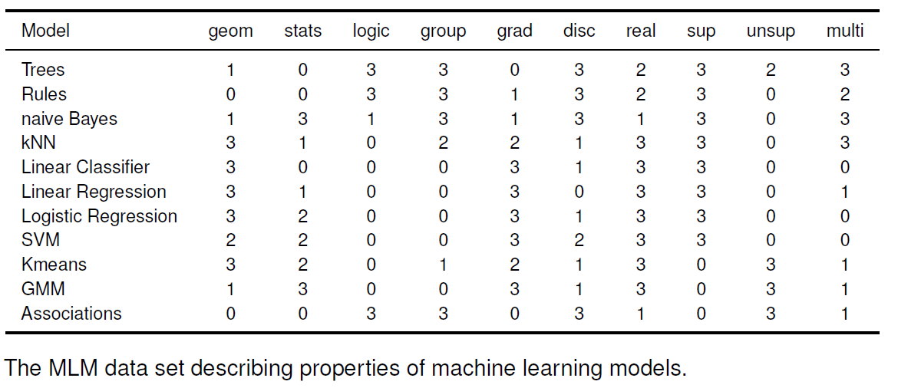

上图每一行对应于一个实例，每一列对应于一个特征。  

* 特征和模型的关系非常密切，模型是由特征而定义的，而且还可以将单个特征转化为**单变量模型（univariate model）**  

#### 特征的两种用法（与区分分组模型与评分模型相呼应）：    

* 第一种重点关注实例空间中的某个特定区域（特别在逻辑模型中），也就是说以某种方法对实例空间进行划分---**作为划分的特征**： 
  * 满足**二元分裂（binary split）**  条件：将实例空间分为两组：
    * 一组满足给定条件
    * 一组则不满足
  * 或者非二元分裂也可行  
* 第二种集中地出现在监督学习中----**作为预测器的特征**。  
  * *特征对于模型的最终决策所做的贡献既精确又可度量。*  
  * 决策时，每一维特征并未被“阈值化”，其“分辨率”被完整地运用于计算实例的得分。  

>  有时他们会同时出现在同一个模型中。    

#### 特征的构造（construction）与变换：    

* 在实值特征中通常包含一些通过**离散化（discretidation）**便可以去除的无用细节。  

  * 在分类任务中，可以通过离散化来提高某个特征的**信噪比（signal-to-noise ratio，SNR）。  

* 通过增加一个第三维的特征，可以得到一个值得关注的技巧：*无须实质上去构建新的特征空间，便可获得该特征空间的分类器。如下图所示，左侧的数据线性不可分，右侧将实例空间映射到一个新的由原始特征的平方构造的新“特征空间”后，这组数据几乎线性可分了：  

  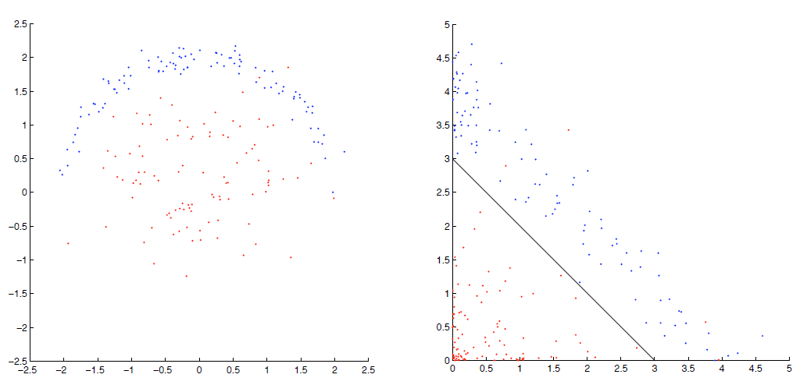

  

## 二 两类分类及相关任务  

* 机器学习中的对象通常被称为**实例（instance）**。  
* 所有可能的实例所构成的集合称为**实例空间（instance space）**。  
* 带有**标签（label）**的实例---**样本**。------构成了**训练集（training set）**。    

下图为预测性机器学习场景：

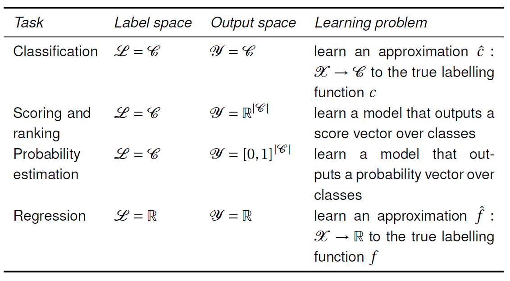

* 数据中可能会存在噪声：  
  * **标签噪声（label noise）**：所观察到的标签携带了噪声。 
  * **实例噪声（instance noise）**：四观测到的实例因某种原因偏离了真实值。  

  

### 分类：  

*分类器的目的在于构造一个函数预测，以使他尽可能地逼近真实类别。*  

* 最简单的情形下，问题域中仅涉及两个类别-----**二元分类（binary classification）**或**概念学习（concept learning）**。  

#### 分类性能的评价：  

可用**列联表（contingency table）**和**混淆矩阵（confusion meatrix）**来概括。  

* **准确率（accuracy）**是最简单的一种指标，所度量的是测试实例中被正确分类的比例。  
* **错误率（error rate）**即被错误分类的实例在整个测试集中所占的比例。    
* **灵敏度（sensitivity）**或者**特异度（specificity）**：
  * **真正率**----对任意正例被正确分类的概率的一个估计。  
  * **真负率**---对任意负例被正确分类的概率的一个估计。    
* 如果感兴趣的类为少数类，且其规模很小，则不应针对多数类的准确率和性能。  
  * 使用**精度（precision）**取代真负率。-----在这预测为正类的实例中实际正例所占的比例。

下图为分类器性能评价指标：  

<<<<<<< HEAD
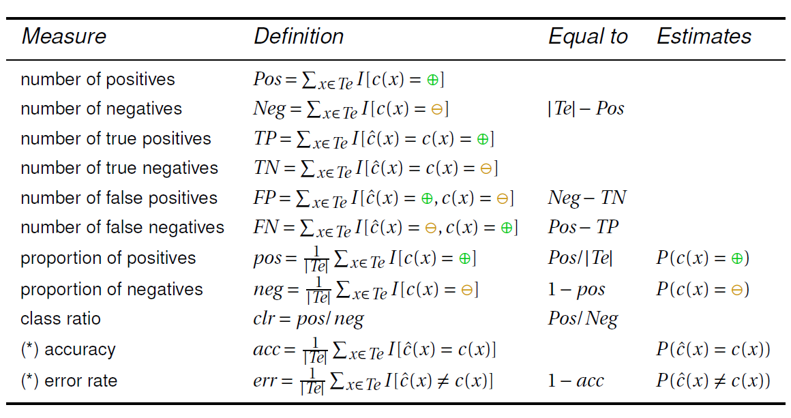

#### 分类性能的可视化：    

**覆盖图（coverage plot）**---将分类器及其他模型的性能可视化的重要工具。  

> 在一个k类的列联表中共有$（k+1）^2$项，而自由度为$k^2$

通常在二分类问题中，对四个数字尤其感兴趣，他们完全确立了列联表的内容：

* 正例的总数Pos
* 负例的总数Neg
* 真正例的个数TP
* 假负例的个数TN

覆盖图通过一个矩形坐标系和一个点便可以将这四个数字可视化。

* 设想一个高度为Pos，宽度为Neg的矩形。

* 并假设x轴对应负例的数目，y轴对应正例的数目。

* x和y轴两者满足*正预测在负预测之前即可*。

  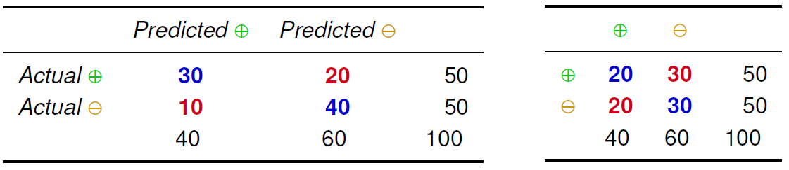

上述两个列联图所对应的覆盖图为：

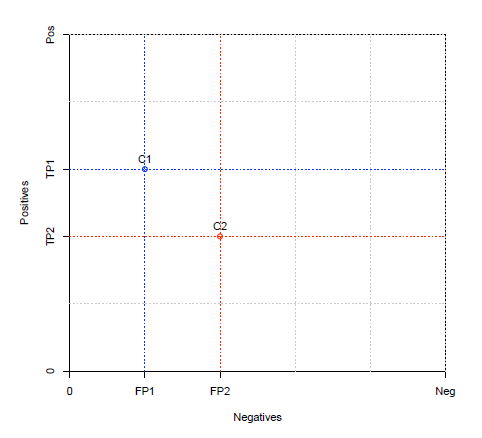

* 通过上覆盖图，可以一眼就看出来了分类器C1比分类器C2的性能好：
  * C1的真正例数目比C2多，而假正例的数目少于C2。
  * 这样可以说C1**支配（dominate）**C2。

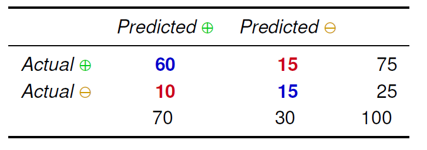

对应的覆盖图为：

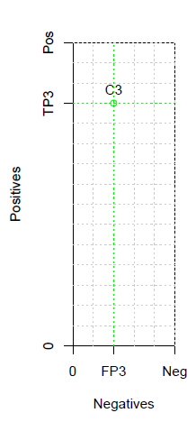

如果还存在第三个分类器C3，如下图左侧所示，会发现同C1分类器处于对角线位置，我们可以说他们拥有相同的准确率。互不支配，但是都可以支配C2. 

* 右侧为上面3个分类器归一化会整合的结果，通过归一化，可以应对不同的类别分布。可以整合不同形状的覆盖图以及整合分类器在具有不同类分布的测试集上的分类结果。
* 该图中的对角线表示C1和C3拥有相同的**平均查全率**--查全率是真正率的一个别名，而平均查全率则是正查全率（真正率）与负查全率（真负率）的均值。
* 这样规范化的覆盖图称为：**ROC图（receiver operating characteristic）**。

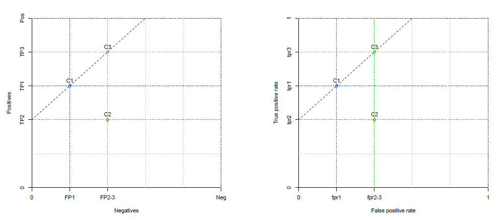

* *在覆盖图中，任意两个具有相同准确率的分类器均可由斜率为1的线段链接。*  

### 评分与排序：  

**评分分类器（scoring classifier）** ----可表示为一个从实例空间到k维实向量的映射，其输出为以向量，而不是一个标量。向量中的每一个值表示将实例划分为对应的类时所获得的分数。

**裕量（margin）**----如果样本所属的真实类c（x）在x为正例时取+1，在x为负例时取-1。则当预测结果正确时，z（x）为c（x）和x的评分的乘积的取值为正，否则为负。该量为评分分类器赋予样本x的裕量。  

* 大的正裕量说明了分类器对这些样本所作出的正确分类的分数高，也就是分类器的准确率高。希望对这些样本给予“奖赏”。

* 借助**“损失函数（loss function）**----即一个样本裕量到与之关联的损失$L(z(x))$的映射。

  * 当$L(0)=1$则表示当样本恰好位于决策面上时产生的损失。

  * 当$z<0$时，$L(z)>=1$;当$z>0$时，$0<=L(Z)<1$，如下图示，为各类损失函数：  

    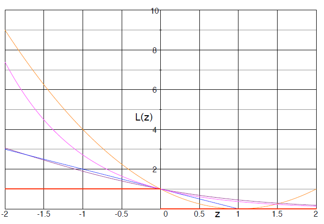

    * 0-1损失：  

      ​	$$z<=0,L_{01}(z)=0$

      ​	否则，$L_{01}(z)=0$  

      * 0-1 损失值考虑了样本的符号，而忽略了样本的裕量。当0-1损失与评分分类器的预测结果一致时，边无法将二者区分。  

      > **凸函数（convex function）**----曲线上任意两点之间线性插值的结果都不可能位于该曲线的下方。  

      * hinge损失函数：  
        * 当$z<=1$时，$L_h(z)=(1-z)$
        * 当$z>1$时，$L_h(z)=0$  
        * 该损失函数名称源于：损失取决于（hinge on）样本的裕量是否大于1。
          * 当裕量大于1时（即待分类样本位于决策面正确的一侧，且到决策面的距离至少为1），该样本所带来的损失为0。否则，损失将会随着裕量的减少而增加。  
          * 避开裕量（远）小于1的那些样本非常重要。这不包括为了获得大的正裕量而采取附加值的情形。  

      

#### 排序性能的评价及可视化  

**排序（ranking）**定义为一组实例集上的全序关系（可能存在并列关系）。  

在覆盖图中，覆盖曲线下方的面积对应于正确排序的实例对的绝对数目，而ROC曲线下方的面积为排序准确率。-----该面积可以简写为AUC。  

* *分组模型的ROC曲线中的线段的数量与模型中实例空间的分划数目一致；*
* *对于数据集中的每个样本，评分模型都有一条线段与之对应。*    

与分组模型相比，评分模型具有更高的“分辨率”------**“模型的求精（refinement）”**  

*通过降低模型的分辨率，有时反而可以获得更好的排序性能。*  

**训练模型的目的不单单在于突出各类样本之间的差异，还在于消除那些误导分类的差异所产生的负面影响。**  

### 类概率估计：  

**类概率估计子（class probability estimator）**或简称概率估计子，是一种评分分类器，其输出为一个概率向量（范围为[0,1])，其中每个分量与一个类别相对应。所以输出的概率向量中的每一个分量值的总和为1。  

*这里的概率表达的是在相似域x类的实例中该类别的实例所占据的比例。*（x~x’)  

> 感觉该类概率估计就是对之前使用的评分的一个缩放，归一化。----by myself    

下图为之前的特征树所导出的概率估计树：

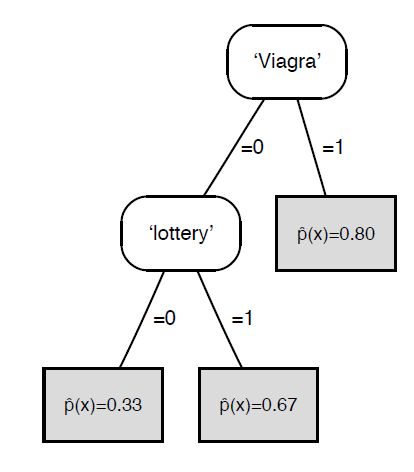

#### 类概率估计量  

* 面临的问题是无法得到各类别真实的概率分布。

* 常使用的策略是先定义一个二值向量（$I[c(x)=C_1],   ,I[c(x)=C_k]$)。

  * 当x的真实类别为$C_i$时，则该向量的第i个分量为1，其余分量均为0，并将它们作为“真实”的概率。

  * 这样以后可以定义一个关于概率向量预测量$\hat{\mathbf{p}}(x)=(\hat{p}_1(x),...,\hat{p}_k(x))$的**平方误差（square error,SE)**：

    $SE(x)=\frac{1}{2}\sum_{i=1}^k(\hat{p}_i(x)-I[c(x)=C_i])^2$  

  * 相应地，**均方误差（mean squared error， MSE）**为测试集中全部实例平方误差的均值：  $MSE(Te)=\frac{1}{|Te|}\sum_{x \in Te}SE(X)$  

> 这种以概率估计量形式定义的误差在预测理论中广为使用，且被称为**布莱尔分数（Brier score）**。 

* **经验概率（empirical probability）**为某个叶子节点覆盖的实例中正例的相对出现频率。
* 通过经验概率，可以从分类器或排序器中获取概率估计量或对其进行求精。  
* *从经验分布（从训练集或带有标注信息的专门用于此目的的测试集获得）入手是获取概率估计的最佳方法。*  
* 需考虑的两个问题：
  * 一是对于某些模型，我们必须确保所预测概率遵循模型所强加的排序结果；
  * 二是当使用评分模型时，我们无法立即获得经验概率，因为每个实例都趋向于分配到其自身的等价类中。  

#### 将排序器转化为概率估计子  

* 可通过并列得分整合线段，可消除ROC曲线中的局部凹面。-----需要识别**毗连离群点（adjacent violator）**。

----------------------------------------------------

## 三 超越两类分类  

### 处理多类问题  

#### 多类分类

* 以两类分类器作为基本模块来构建单个k类分类器：

  * **一对多**或**一对其余（one-versus-rest）**方案是指首先训练k给两类分类器：
    * 第一个分类器的功能是将$C_1$类与$C_2,...,C_n$类区分开来；
    * 第二个分类器是将$C_2$类与$C_1,C_3,...,C_n$类区分开来；
    * 以此类推，在训练第i个分类器时，将来自$C_i$类的所有实例视为正例，而将其余实例均视为负例。  
  * **一对一（one-versus-one）**方案：  
    * 训练$k(k-1)/2$个两类分类器，即为每个不同的类别对都学习一个两类分类器。
    * 如果两类分类器按照非对称的方式来处理不同的类别，则为每个类别对训练**两个**分类器便很有意义，在这种情况下，就需要训练$k(k-1)$个两类分类器。

  上述两种方案都可以借助所谓的**输出编码矩阵（output code matrix）**将k类分类任务分解为l个两类分类问题。  

  * *一对多*和*一对一*方案是将两类分类器转化为多类分类器最常用的两种手段，在采用一对多方案时，为了强制做出决策，必须在学习前或学习后设定给类别的顺序；
    * 如果是一对一方案，则可通过投票的方式做出决策。  

* 如果两类分类器可输出得分，则可以使用得分$s_i$标识不同类别，然后使用编码矩阵中恰当的项来计算裕量$z_i=s_ic_{ji}$，并将其传给某个损失函数L。

  * 因此可以把得分向量$\mathbf{s}$与第j个码字$\mathbf{c}_j$之间的距离定义为：  

    $$d(\mathbf{s},\mathbf{c}_j)=\sum_iL(s_ic_{ji})$$

  * 把可以将该距离最小化的类别作为最终决策。

  * 这种基于两类得分来实现多类决策的方法称为**基于损失的解码（loss-based deconing）**。

#### 多类得分及概率  

依据多个两类分类器来计算多类得分和概率：

* 使用基于损失的解码所得到的距离，并通过一些恰当的变换将其转化为得分。（该方法仅适用于两类分类器能够输出单尺度上经校正的得分的情形。）
* 将每个两类分类器的输出作为特征（如果使用的是得分，则为实值；如果仅使用预测类别标号，则为二值型）并训练一个可产生多类得分的模型。（如朴素贝叶斯模型，树模型。该方法具有普适性，但需要引入额外的训练过程。）
* 从**覆盖计数（coverage count）**---即每类中被两类分类器预测为正类的实例总数。中导出得分。

**利用两类分类器解决k类问题的一般步骤为*： 

 * 将问题分解为l个两类学习问题；
 * 在原始数据的两类版本上训练l个两类分类器；
 * 整合这l个分类器的预测结果，最终得到k类问题的预测结果。  

-------------------------------------------

### 回归  

**函数估计子（function estimator）**----也称**回归器（regressor）**，本质上是一个映射$\hat{f}:X \to \mathbb{R}$。

回归的目标也就是从实例集$(x_i,f(x_i))$中学习一个函数的估计子。  

但是在回归中如果一味地试图在函数估计子匹配这种精度，则势必会造成过拟合。因此，一般会做出一些合理的假设：  

**实例中含有噪声，且估计子的核心目标是从数据中捕捉到一般性的趋势或函数的形状。**    

* 如果模型中包含的参数越多，就越能精确地拟合给定点集，则会很容易造成过拟合。  
* 为了避免过拟合，从数据中估计的参数数量与数据点个数相比必须充分小。  

回归模型的评价通过将损失函数应用于**残差（residual）**$f(x)-\hat{f}(x)$来实现。  

> **偏差-方差的两难问题（bias-variance dilemma）**：低复杂度的模型受训练数据中由随机噪声引起的变化的影响较小，但却可能引入系统偏差，即使采用大量数据也无力克服这一问题；
>
> 另一方面，高复杂度的模型虽然能够消除偏差，却容易带来由方差引起的非系统误差。

------------------------

### 无监督学习及描述性学习    

**描述性学习**：采用某种方式对数据进行描述，即生成一个描述性模型。该任务的输出同学习的输出相同。  

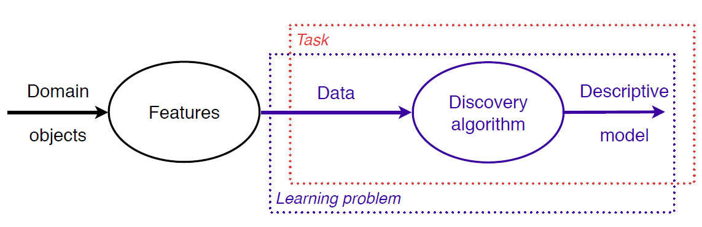

**在描述性学习中，任务与学习问题二者是一致的。**  

#### 预测性聚类与描述性聚类  

**聚类**：从未标注的数据中学习一个新的标记函数。  

预测性聚类与描述性聚类的区别：  

* 预测性聚类通过训练集训练模型，该模型可以将新的数据分配到某个簇中；
* 而描述性聚类则是通过数据集D学习模型，然后该模型只能给D进行聚类。也就是说该任务变成了为给定数据学习一个适宜的聚类模型。

#### 其他描述性模型  

**子群模型（subgroup model）**：并不试图去逼近标记函数，而是着眼于识别那些其类分布与总体分布存在差异的子集。（描述性模型）》有监督学习。 

**关联规则发现**：（描述性无监督学习）关联指的是那些经常一同出现的事物。要发现关联规则，首先要识别出那些经常一同出现的特征。  

------------------------------------

## 四 概念学习    

主要涉及**逻辑模型**----特点是它们均通过逻辑表达式将实例空间划分为一组间隔，因此所构建的都是分组模型（grouping model）。  

目标概括为：针对要解决的问题，找到可使每个区隔中的数据更为一致的实例空间划分方案。

本质上，逻辑模型分为：  

* 规则模型  -----由一组蕴涵式或if-else规则构成，其中if部分定义了一个区隔，而then部分定义了模型在该区隔间的行为。

* 树模型-----是一种受限型的规则模型，其规则的if部分是以树形结构组织的。

### 假设空间：  

*最简单的概念学习设置是限定用于描述概念的逻辑表达式为：仅由一组文字的合取构成。*  

**假设空间（hypothesis space）**-----全部可能的概念所构成的空间。  

#### 最小一般性：  

从数据中找到的最小一般性假设----**最小一般泛化（Least General Generalization， LGG）**。  

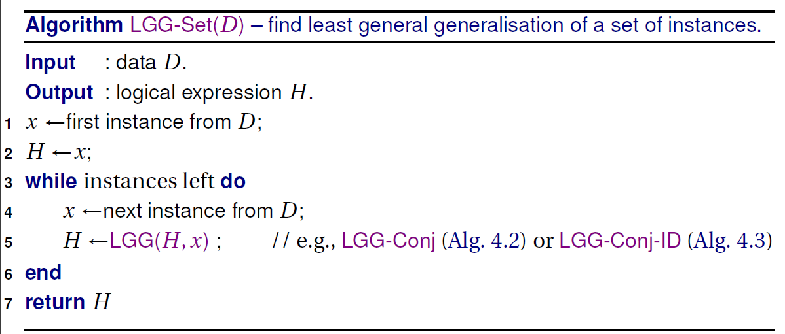

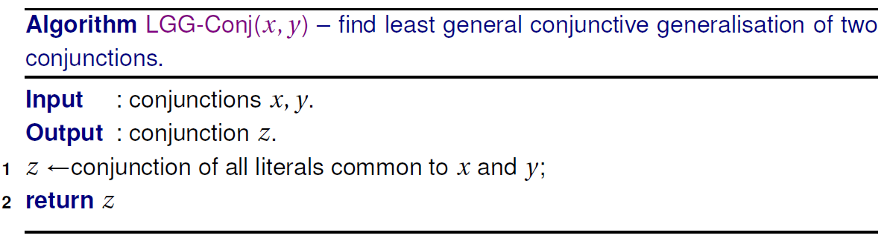

* 两个实例的LGG是假设空间中最近的概念。  
* 交点唯一的假设空间形成了一个**格状结构（lattice）**：其中每两个元素之间的偏序都存在一个*上确界（least upper bound，lub）*和一个*下确界（greast lower bound，glb）*。  
* LGG正是该格状结构中实例的上确界。也是所有实例的泛化集的下确界。----**所有可能的泛化所具有的一般性都至少与LGG相当。**
* **LGG是我们能够从数据中学习到的最为保守的泛化。**

#### 内部析取：  

内部析取：一种受限形式的析取。  

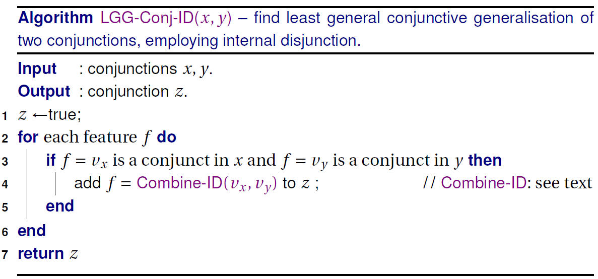

上图为运用内部析取计算两个合取的LGG的详细步骤。： 

* 当$v_x$和$v_y$为常量时，返回$[v_x,v_y]$
* 当$v_x$和$v_y$为一些值的集合时，返回二者的并。  

### 通过假设空间的路径  

**最小一般假设和最大一般假设之间的每一个概念也都是可能的假设。**  即它们都可覆盖所有的正例，且不覆盖任何负例。  

**版本空间**----如果一个概念能够覆盖所有的正例则称该概念是*完备的*。如果一个概念未覆盖任何负例，则称其具有*相容性*。*版本空间（version space）*是由所有完备的相容概念构成的集合。该集合为一个凸集，且由其最小一般元素和最大一般元素完全定义。  

* 通过假设空间中的一条向上路径对应一条覆盖曲线，从而对应于某个排序序列。
* 概念学习可视为寻求通过假设空间的最优路径问题。

#### 最一般相容假设  

**概念的最小特化（minimal specialisation）**：指可在假设网格结构中向下一步所到达的假设。  

可以调用下面的算法来获得某个给定概念的所有最一般相容特化的流程，若取$C=true$，将返回最一般相容假设。  

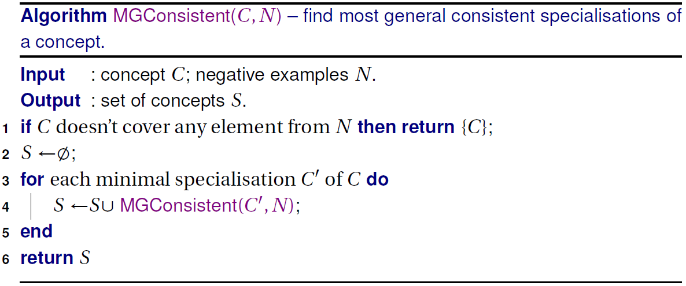

#### 封闭概念  

**封闭概念（closed concept）**----一个概念包含了所以隐式承认的条件。  

封闭概念是他所覆盖的所有实例的LGG。  

对封闭概念给予适当关注可以显著缩小假设空间。  

### 超越合取概念  

  学习Horn理论：  

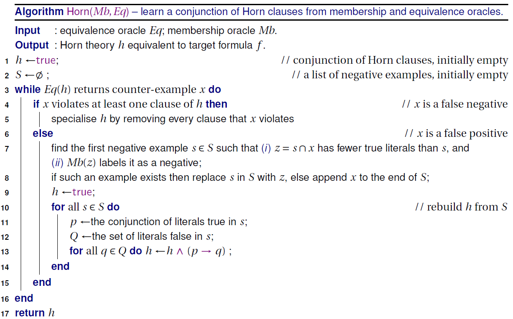

