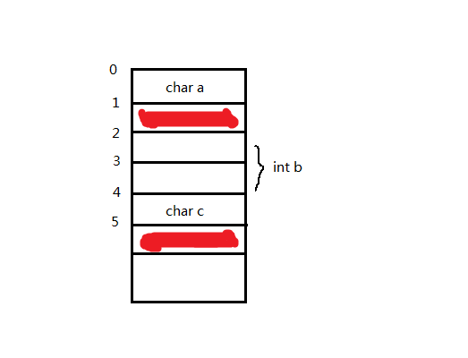
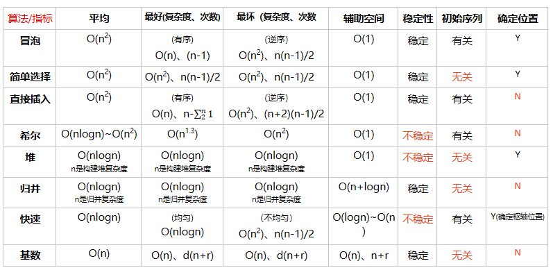

### 1、优先级


## 2、 Linux相关

* 输出当前路径

```
echo $(pwd)
```

* 在使用VI编辑器的时候，查找内容的方法有两种：

  1、“/”：这个查找是自上而下

  2、“？”：这个查找是自下而上

  针对“/”：使用“n”查找下一个，使用“N”查找上一个

* 下面关于i节点描述错误的是？ 

  ​	i节点和文件名是一一对应的

  inode，中文译名为"索引节点"，包括内容：

  ​        * 文件的字节数
  \* 文件拥有者的User ID   
  \* 文件的读、写、执行权限
  \* 文件的时间戳，共有三个：ctime指inode上一次变动的时间，mtime指文件内容上一次变动的时间，atime指文件上一次打开的时间。
  \* 链接数，即有多少文件名指向这个inode
  \* 文件数据block的位置  

* 以下哪些命令可以获取linux主机的负载相关指标   

  ```
  uptime
  top
  sar
  ```

  uptime命令过去只显示系统运行多久。现在，可以显示系统已经运行了多长时间，信息显示依次为：现在时间、系统已经运行了多长时间、目前有多少登陆用户、系统在过去的1分钟、5分钟和15分钟内的平均负载。

  top命令可以查看系统整体状态

  最后一些输出信息的解释：

  load average: 0.09, 0.05, 0.01

  三个数分别代表不同时间段的系统平均负载(一分钟、五 分钟、以及十五分钟)，它们的数字是越小越好。在多核处理中，系统的均值不应该高于处理器核心的总数量

  进程使用的内存可以用top,有3个列VIRT RES SHR, 标示了进程使用的内存情况, VIRT标识这个进程可以使用的内存总大小, 包括这个进程真实使用的内存, 映射过的文件, 和别的进程共享的内存等. RES标识这个这个进程真实占用内存的大小. SHR标识可以和别的进程共享的内存和库大小.

  sar -u输出显示CPU信息。-u选项是sar的默认选项。该输出以百分比显示CPU的使用情况

  ls跟dos下的dir命令是一样的都是用来列出目录下的文件

  crontab是一个定时执行任务命令，不能查看系统负载。

## 3、C/C++相关    

* 32位机上，给你1、2、3 这三个数字，可以使用C的各种运算符，你能在计算机上得到的最大的整数是（）

```C
(unsigned long)(2-3)*1
```


* 在一个16位的机器，以下结构由于边界对齐浪费了多少空间

  ```C
  struct{
  	chara;
      intb;
      charc;
  } 
  ```

     

* 本题是16位机器，char型占1个字节，int型占2个字节。

  结构体中字节对齐有两条规则：

  1. 数据成员自对齐，即数据成员起始地址为数据类型长度的整数倍，如该题int型b只能从0，2，4...等地址处开始放；
  2. 结构体总长度是结构体中有效对齐值的整数倍，有效对齐值，如该题没明确指出，则为最长数据成员(int b)长度的整数倍；

  根据上面两条规则，画出内存示意图。根据规则1，int b从2处开始放，此时结构体总长度为(1 + 1 + 2 + 1 = 5)；再根据规则2，结构体总长度应为2的整数倍，故应为6.描红的两个字节表示被浪费的。

  

* x是一个行列数均为1000二维数组，下面代码效率执行最高的是（） 

  ```C
  for(int i=0;i<1000;i++) for(int j=0;j<1000;j++) x[i][j]+=x[i][j];
  ```

  主要是考察了CPU cache的预取操作，数组x[1000][1000]在内存中，是按行进行存储。D选项外部循环是按行进行，因此操作第i行时，会将第i行后面的部分数预取到cache中，操作速度最快。

  ABC选项其中都有跳列的操作，不能发挥cache的预取操作功能。  

* 下列关于makefile描述正确的有？ 

  - makefile文件保存了编译器和连接器的参数选项

  - 主要包含了五个东西：显式规则、隐晦规则、变量定义、文件指示和注释

  - 默认的情况下，make命令会在当前目录下按顺序找寻文件名为“GNUmakefile”、“makefile”、“Makefile”的文件， 找到了解释这个文件

    makefile文件保存了编译器和连接器的参数选项,还表述了所有源文件之间的关系(源代码文件需要的特定的包含文件,可执行文件要求包含的目标文件模块及库等).创建程序(make程序)首先读取makefile文件,然后再激活编译器,汇编器,资源编译器和连接器以便产生最后的输出,最后输出并生成的通常是可执行文件.创建程序利用内置的推理规则来激活编译器,以便通过对特定CPP文件的编译来产生特定的OBJ文件.  Makefile里主要包含了五个东西：显式规则、隐晦规则、变量定义、文件指示和注释。  1、显式规则。显式规则说明了，如何生成一个或多的的目标文件。这是由Makefile的书写者明显指出，要生成的文件，文件的依赖文件，生成的命令。 2、隐晦规则。由于我们的make有自动推导的功能，所以隐晦的规则可以让我们比较粗糙地简略地书写Makefile，这是由make所支持的。  3、变量的定义。在Makefile中我们要定义一系列的变量，变量一般都是字符串，这个有点你C语言中的宏，当Makefile被执行时，其中的变量都会被扩展到相应的引用位置上。  4、文件指示。其包括了三个部分，一个是在一个Makefile中引用另一个Makefile，就像C语言中的include一样；另一个是指根据某些情况指定Makefile中的有效部分，就像C语言中的预编译#if一样；还有就是定义一个多行的命令。有关这一部分的内容，我会在后续的部分中讲述。  5、注释。Makefile中只有行注释，和UNIX的Shell脚本一样，其注释是用“#”字符，这个就像C/C++中的“//”一样。如果你要在你的Makefile中使用“#”字符，可以用反斜框进行转义，如：“\#”。  默认的情况下，make命令会在当前目录下按顺序找寻文件名为“GNUmakefile”、“makefile”、“Makefile”的文件，找到了解释这个文件。在这三个文件名中，最好使用“Makefile”这个文件名，因为，这个文件名第一个字符为大写，这样有一种显目的感觉。最好不要用 “GNUmakefile”，这个文件是GNU的make识别的。有另外一些make只对全小写的“makefile”文件名敏感，但是基本上来说，大多数的make都支持“makefile”和“Makefile”这两种默认文件名。 在Makefile使用include关键字可以把别的Makefile包含进来，这很像C语言的#include，被包含的文件会原模原样的放在当前文件的包含位置。include的语法是：  include <filename>; filename可以是当前操作系统Shell的文件模式（可以保含路径和通配符）     

  - 当不同的类具有相同的间接基类时，（）。  

    * 为了建立唯一的间接基类版本，应该声明派生类虚继承基类

      **在派生列表中，同一基类只能出现一次，但实际上派生类可以多次继承同一个类。派生类可以通过两个直接基类分别继承自同一间接基类，也可以直接继承某个基类，再通过另一个基类再次继承该类。但是，如果某个类派生过程中出现多次，则派生类中将包含该类的多个子对象，这种默认情况在很多有特殊要求的类中是行不通的。虚继承就是为了应对这一情况而产生，虚继承的目的是令某个类做出声明，承诺愿意共享其基类。这样不论虚基类在继承体系中出现多少次，派生类中都只包含唯一一个共享的虚基类子对象。 **

## 4、系统相关  

* 下面关于系统调用的描述中,错误的是()

正确答案: B   

```
系统调用把应用程序的请求传输给系统内核执行
```

```
系统调用中被调用的过程运行在"用户态"中
```

```
利用系统调用能够得到操作系统提供的多种服务
```

```
是操作系统提供给编程人员的接口
系统调用给用户屏蔽了设备访问的细节
系统调用保护了一些只能在内核模式执行的操作指令
```

## 4、数据结构  

### 树：

* 一棵左子树为空的二叉树在前序线索化后,其中空的链域的个数是() 

  * 一棵左子树为空的二叉树,形态为右单支树,这样前序序列为根、右根...  因为根结点在前序序列第一个,没有前序的前驱,这样根结点的左指针链域就是空的  最下边的叶子（也就是最右边结点）是前序序列最后一个,没有前序的后继,因此该结点的右指针链域也是空的  因此,空的链域合计2个   

* 在一个10阶的B-树上，每个树根结点中所含的关键字数目最多允许为( )个，最少允许为( )个。 

  ​	9,4

  最多M-1  最少M/2-1 向上取整。      

  **一个m阶的B树具有如下几个特征：**

  1.根结点至少有两个子女。

  2.每个中间节点都包含k-1个元素和k个孩子，其中 m/2 <= k <= m

  3.每一个叶子节点都包含k-1个元素，其中 m/2 <= k <= m

  4.所有的叶子结点都位于同一层。

  5.每个节点中的元素从小到大排列，节点当中k-1个元素正好是k个孩子包含的元素的值域分划。

  B-树主要用于文件系统及部分数据库索引。    

* 广告系统为了做地理位置定向，将IPV4分割为627672个区间，并标识了地理位置信息，区间之间无重叠，用二分查找将IP地址映射到地理位置信息，请问在最坏的情况下，需要查找多少次? 

  * 即求树的深度为log2(627672 )+1 


### 链表：  

* 双向链表中有两个指针域,llink和rlink,分别指回前驱和后继,设p指向链表中的一个结点,q指向一待插入结点,现要求在p前插入q,则正确的插入为() 

  `p->llink->rlink=q;q->rlink=p;q->llink=p->llink;p->llink=q;`  

  * **中心思想是先要让p断开与前面的两条连线，然后再将前面的节点与q，q与p的连线连好。**

### 排序

* 在所有排序方法中，关键字比较的次数与记录的初始排列次序无关的是（） 

  ​	选择排序  

   

### 查找：  

* 折半查找与二元查找树的时间性能在最坏的情况下是相同的() -----错。
  * 折半查找的查找长度至多为**log（n） +1**，二元查找树最坏时需查找**n**次(数列有序，树只有左孩子或只有右孩子，退化为线性表) 。

## 5、Python  

* ```python
  counter = 1 
  def doLotsOfStuff(): 
      global counter
      for i in (1, 2, 3): 
          counter += 1 
  doLotsOfStuff()
  print counter
  ```

输出为4。局部作用域 doLotsOfStuff() 函数中，global声明对全局作用域中的 counter 变量的引用。


## 6、智力题  

一架飞机在满油的情况下可以绕地球飞 0.5 圈，假设飞机与飞机之间可以互相加油，请问在确保所有飞机够油飞回起点的情况下，最少需要几架飞机才可以让其中一架飞机成功绕地球飞行一圈？（提示1：地球是圆的！提示2：飞机可以重复使用！）   

A。只需要ABC共3架飞机。

3架共同出航，A1/8圈后返航，1/4圈油分给BC；B继续1/8圈至1/4圈处后返航，1/8圈油给C；C继续飞行1/2圈至3/4圈处空油。

C飞行至1/2圈时，AB反向共同出航，A1/8圈后至7/8圈处返航，1/8圈给B(加满)；B继续飞行1/8圈后至3/4圈处恰遇C，B给C1/8圈油共同返航；于此同时A重新反向出发再次至7/8圈处恰遇C，给C1/8圈油后，3机共同返航。